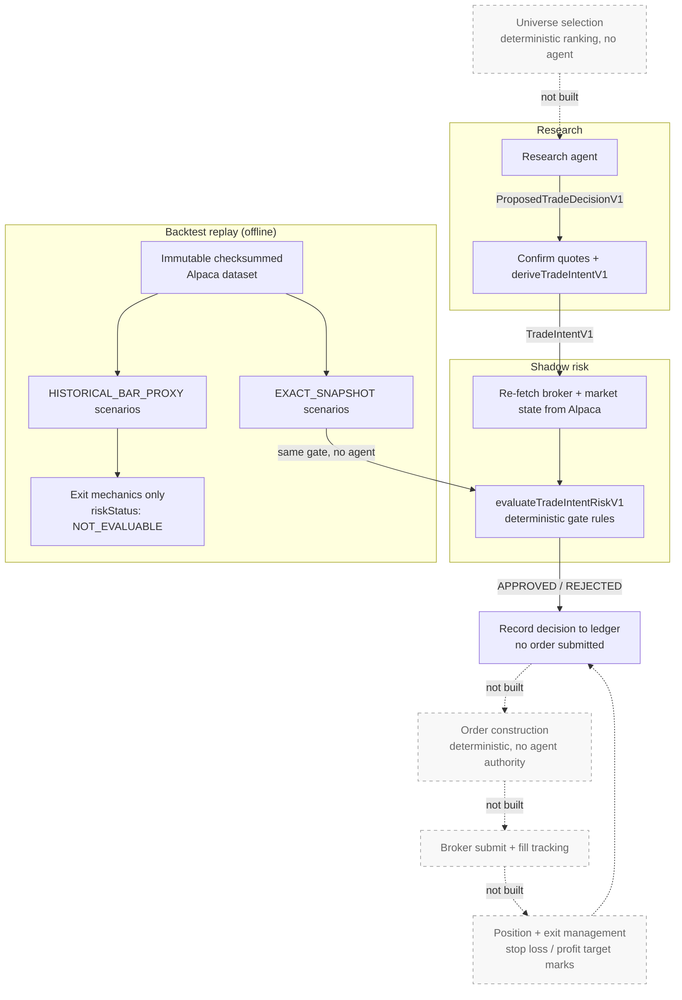

# greeks-in-the-loop

Read-only paper-trading research agent built with the OpenCode SDK, Alpaca, Financial Modeling Prep, and Exa.

The worker is intentionally non-executing. Its dedicated `research` agent can inspect read-only paper-account and market data, gather FMP and Exa evidence, write artifacts under `workspace/`, and emit a validated `ResearchDecisionV1` or non-executable `PreliminaryResearchV1`. Preliminary findings are durably carried forward for mandatory refresh. Only an eligible regular-session proposal is confirmed against a fresh, application-owned Alpaca indicative quote snapshot and deterministically converted into a non-executable `TradeIntentV1`. The application then captures read-only broker state, refreshes the intent, and records a deterministic shadow-risk approval or rejection without submitting an order.

The research agent is deny-by-default: broker mutations, generic shell execution, source edits, external-directory access, subagents, and unreviewed tools are unavailable. The managed runtime ignores user-global OpenCode plugins and MCP configuration, and each project MCP process receives only its own credentials. Risk and execution authority remain outside OpenCode.

## Research to risk flow



Backtest replay is a separate offline entry point (`pnpm backtest`), not a stage in the live cycle. It feeds `EXACT_SNAPSHOT` scenarios into the **same** `evaluateTradeIntentRiskV1` the live path uses, with no agent in the loop; `HISTORICAL_BAR_PROXY` scenarios never reach the gate and exercise exit mechanics only. Its output is a report file — no runtime code reads it back, and no backtest result influences a live decision. See [Why backtest replay exists](#why-backtest-replay-exists).

Solid edges are implemented today. Dotted nodes are deferred: universe selection upstream, and the execution path downstream where the shadow decision is recorded but never acted on.

**Universe selection** (deferred, tracked in #34) would replace the hard-coded SPY underlying with a small allowlist of liquid ETFs and pick one symbol per cycle. Three properties matter:

- **Deterministic, no agent.** Selection ranks candidates by regime-signal strength and liquidity using pure functions — same persisted snapshot, same chosen symbol. Putting a model here would make cycle inputs irreproducible and break replay.
- **Upstream of research, invisible to risk.** Selection decides *what* to research; the gate evaluates the resulting intent identically regardless of which symbol was chosen. `evaluateTradeIntentRiskV1` should never learn a universe exists.
- **Selection precedes snapshot capture.** Only the chosen symbol's chain is fetched, so cost and quote freshness stay bounded as the universe grows.

The staged approach is parameterize first, expand later: replace the `SPY` literals with an allowlist holding only `{SPY}` — zero behavior change, all tests unchanged — then add the ranking layer, then admit two or three more ETFs once ranking is proven. Changing the underlying is a major strategy version bump, so it is worth doing once. The shared prerequisites are now in place: OCC symbol parsing is consolidated behind `src/shared/alpaca-option-identity.ts`, and strategy identity resolves through `src/strategy/strategy-registry.ts` rather than scattered literals. One open design question remains: `entriesSubmittedToday` is portfolio-wide today, so per-symbol versus portfolio entry limits needs an explicit decision rather than an inherited one. `TradeIntentV1` already carries `stopLossMarkHalfCentsPerShare` and `profitTargetMarkHalfCentsPerShare` for that future exit layer, and `evaluateTradeIntentRiskV1` pins `approvedQuantity: 1`. The agent has no order-construction or submission interface in any of these stages, built or planned.

**What crosses the research to risk boundary:** only the proposed spread's *identity* (direction, structure, expiration, the two OCC leg symbols) carries through. Every financial input the gate uses — equity, buying power, positions, live quotes, greeks, volume/open interest, market clock — is re-fetched by the risk engine itself; research's numbers are never trusted for the decision.

**What comes back:** a `ShadowRiskDecisionV1` (`STATE_CAPTURE_FAILED` \| `INTENT_REFRESH_FAILED` \| `EVALUATED` with `APPROVED`/`REJECTED` + reason codes) plus any newly latched breaker transitions. Nothing is executed — the decision is only recorded to the event ledger.

## Strategy

The frozen MVP strategy is documented in [SPY Directional Debit Spreads](docs/strategy-v1.md). It assumes the project will remain on the free Alpaca Basic data tier. The specification defines future execution behavior; the current worker remains non-executing and evaluates every live intent in shadow mode.

`docs/` holds the authoritative specifications. Consult these before changing contract or rule behavior:

| Spec | Covers |
| --- | --- |
| [Strategy V1](docs/strategy-v1.md) | Frozen MVP strategy and versioning policy |
| [Risk Engine V1](docs/risk-engine-v1.md) | Gate rules, thresholds, and rejection codes |
| [Trade Intent V1](docs/trade-intent-v1.md) | Derived spread economics and integer-cent units |
| [Research Decision V1](docs/research-decision-v1.md) | The agent-output trust boundary |
| [Research Report V2](docs/research-report-v2.md) | Bounded report retained per cycle |
| [Event Ledger V1](docs/event-ledger-v1.md) | Append-only audit record and SQL invariants |
| [Backtest Replay V1](docs/backtest-replay-v1.md) | Offline scenario contracts and fidelities |
| [Research Market Snapshots V1](docs/research-market-snapshots-v1.md) | Application-owned market-data identity (data only; capture and use are unbuilt) |
| [Pre-Market Research V1](docs/pre-market-research-v1.md) | Research vs. trade-intent eligibility windows |
| [Research Source Policy](docs/research-source-policy.md) | Source precedence and freshness rules |
| [Research Behavior Evaluation](docs/research-behavior-evaluation.md) | Prompt-behavior evaluation record |
| [Offline Research Evaluation](docs/research-evaluation.md) | Deterministic run-scoring dimensions and privacy boundary |
| [Observability](docs/observability.md) | Tracing configuration and span layout |

## Requirements

- Node.js 22
- pnpm 10
- Python 3.10+ and `uvx`
- Alpaca paper-trading, FMP, and Exa API keys

## Setup

```bash
pnpm install
cp .env.example .env
```

Populate `ALPACA_API_KEY`, `ALPACA_SECRET_KEY`, `FMP_API_KEY`, and `EXA_API_KEY` in `.env`. `ALPACA_MARKET_DATA_BASE_URL` defaults to `https://data.alpaca.markets` and normally does not need to change.

## What you can run

Run one live research cycle. This reads the configured paper account and external data sources, writes local state, and never submits an order:

```bash
pnpm agent:once
```

Run continuously at `AGENT_INTERVAL_MS` (five minutes by default):

```bash
pnpm agent
```

Run one research-only cycle at any time on the current Alpaca trading date:

```bash
AGENT_CYCLE_TIMEOUT_MS=300000 pnpm agent:research-anytime
```

This mode bypasses only the time-of-day research window. Alpaca's calendar must
still identify today in New York as a trading date. The cycle is durably marked
`DRY_RUN_ANYTIME`, cannot open a trade-intent window, and cannot derive an
intent even if the model proposes one. It uses live read-only providers and
writes a dedicated `.state/research-anytime.sqlite` ledger plus the normal JSON
export. Substantive research requires Exa; FMP context is optional. No `.env`
change is required.

Run the complete research, intent-derivation, and shadow-risk chain without the
production quarter-hour window:

```bash
AGENT_CYCLE_TIMEOUT_MS=300000 pnpm agent:shadow-anytime
```

This mode remains non-executing, requires Alpaca to identify the current New
York date as a trading session, and retains the normal freshness and
deterministic risk gates. It records `DRY_RUN_SHADOW_ANYTIME` provenance in the
dedicated `.state/shadow-anytime.sqlite` ledger and cannot use the configured
production ledger. The agent may still return `NO_ACTION` or preliminary
research when the strategy does not support a proposal.

The shadow-anytime trade-intent window is a synthetic processing boundary used
to exercise the chain. It is not evidence that the proposal was valid during a
production trading slot and must not be interpreted as live trade validity.

To use another isolated ledger, pass it explicitly. The command rejects the
configured production ledger:

```bash
pnpm agent:research-anytime -- --ledger .state/quality-run.sqlite
```

Build and run the compiled worker:

```bash
pnpm build
node dist/index.js --once
```

Interactive terminals show colored, aligned pipeline rows for eligibility,
agent and tool summary, report and decision validation, quote confirmation,
intent economics, risk-state capture and evaluation, ledger commit, and
artifact output. The final rows include deterministic offline-audit counts,
non-executing actionability, and both artifact paths without printing the full
Markdown brief. Redirected output automatically uses JSONL. Set
`AGENT_LOG_FORMAT=pretty` or `AGENT_LOG_FORMAT=json` to override detection.
Logs intentionally exclude model prose, tool inputs and responses, account
balances, positions, credentials, and raw provider payloads.

Useful environment controls are documented in [`.env.example`](.env.example):

| Setting | Purpose |
| --- | --- |
| `RESEARCH_LEDGER_PATH` | Selects the exclusively owned SQLite ledger. |
| `AGENT_PREMARKET_START_ET` | Sets the earliest research time on an Alpaca trading date, in `America/New_York`. |
| `AGENT_CYCLE_TIMEOUT_MS` | Limits one model/research cycle (five minutes by default). |
| `AGENT_LOG_FORMAT` | Selects `pretty` or `json` pipeline logs; defaults from TTY detection. |
| `AGENT_INTERVAL_MS` | Controls continuous-run spacing. |
| `AGENT_MAX_CYCLES` | Stops a continuous run after a bounded number of attempts. |
| `AGENT_TASK` | Adds an operator objective to the structured research prompt. |
| `OTEL_EXPORTER_OTLP_ENDPOINT` | Optionally enables fail-open OTLP HTTP/protobuf tracing. See [Research tracing](docs/observability.md). |

The worker creates a fresh OpenCode session for every cycle and shuts down cleanly on `SIGINT` or `SIGTERM`. Every cycle selects the checked-in `research` agent; this identity cannot be overridden through `.env`. Each eligible cycle durably records exactly one bounded outcome: `VALIDATED_NO_ACTION`, `PRELIMINARY_RESEARCH_RETAINED`, `DECISION_REJECTED`, `INTENT_DERIVATION_REJECTED`, or `INTENT_DERIVED`. Cycles outside the configured research window are skipped before an OpenCode session is created.

### Single-instance worker ownership

One process on a host may own a selected worker ledger at a time. The worker
acquires a persistent `<ledger>.worker-lock.sqlite` sidecar before opening or
migrating the ledger, starting telemetry, launching OpenCode/MCP descendants, or
running provider calls. A second process targeting the same canonical ledger
fails immediately with an actionable error. The sidecar file is not ownership
by itself: a live SQLite exclusive transaction is the lock, and the operating
system releases it automatically after clean shutdown or process termination.
The sidecar remains in place between runs and must not be deleted as part of
normal cleanup.

The standard daemon and a standard `--once` invocation conflict when they use
the same ledger. Research-anytime and shadow-anytime use separate ledgers by
default, so they do not conflict with production; two runs targeting the same
explicit anytime ledger do conflict. Read-only commands such as
`research:evaluate` and `risk:report` do not acquire worker ownership and may
inspect the WAL-backed ledger concurrently. `research:run` remains unlocked but
may migrate the ledger before projecting or exporting a run, so do not invoke it
concurrently with the worker.

This is a single-host lock scoped to the canonical ledger, not a distributed
lease. Deploy one production ledger per Alpaca account, complete shutdown before
a rolling replacement starts, and do not run active-active workers for the same
account from different hosts or ledger paths.

The append-only SQLite event ledger defaults to `.state/research-ledger.sqlite`; override it with `RESEARCH_LEDGER_PATH` only when the worker retains exclusive write ownership. On startup, incomplete cycles are marked `PROCESS_RESTART`, cycle numbering resumes from durable history, and a bounded context projection is rebuilt for the next prompt. Prior evidence is planning context only and must be refreshed. OpenCode session memory is never authoritative durable state.

The anytime command intentionally ignores `RESEARCH_LEDGER_PATH` unless it is
needed to detect an unsafe collision. Its default ledger is isolated so dry-run
research cannot enter the normal worker's durable prompt context.

Every completed eligible cycle is projected into a versioned `ResearchRunV1` after the worker rereads its committed events. The projection consolidates cycle identity and timing, initial eligibility, evidence snapshot references, the validated outcome and intermediate records, the full bounded [`ResearchReportV2`](docs/research-report-v2.md), any shadow-risk decision and breaker transitions, and ledger sequence metadata. A byte-for-byte regenerable inspection-only JSON export and a deterministic Markdown operator brief are then written under `workspace/research/<session-date>/cycle-<number>-<cycle-id>.{json,md}`. SQLite is the sole source of truth: the worker never builds either export from a separate in-memory result, and an export failure does not undo the committed ledger outcome.

## Inspect a run

Show the latest completed run directly from an isolated ledger, or select a cycle:

```bash
pnpm research:run -- --ledger .state/research-anytime.sqlite
pnpm research:run -- --ledger .state/research-anytime.sqlite --cycle <cycle-id>
pnpm research:run -- --ledger .state/research-anytime.sqlite --format markdown
```

Regenerate its canonical portable JSON and Markdown brief from SQLite (`--force` replaces both files). The default command prints the JSON path; select the Markdown path with `--format markdown`:

```bash
pnpm research:run -- --ledger .state/research-anytime.sqlite --export --force
pnpm research:run -- --ledger .state/research-anytime.sqlite --export --force --format markdown
```

Inspect the event timeline or the validated JSON payloads in a ledger:

```bash
sqlite3 .state/research-anytime.sqlite "SELECT sequence, event_type, occurred_at FROM ledger_events ORDER BY sequence;"
sqlite3 -json .state/research-anytime.sqlite "SELECT sequence, event_type, json(payload_json) AS payload FROM ledger_events ORDER BY sequence;"
```

To inspect exact quotes and calculated spread economics when an intent was successfully derived:

```bash
sqlite3 -json .state/research-ledger.sqlite "SELECT json(payload_json) AS trade_intent FROM ledger_events WHERE event_type = 'TRADE_INTENT_DERIVED' ORDER BY sequence DESC LIMIT 1;"
```

## What gets saved

SQLite stores an append-only event stream in `ledger_events`. Each row contains event identity, version, timestamps, correlation/causation identifiers, cycle and session identifiers, and a schema-validated `payload_json`.

| Data | SQLite | JSON artifact | Notes |
| --- | --- | --- | --- |
| Session and cycle lifecycle | Yes | Yes | Includes cycle/session identity, timing, initial eligibility, completion status, and ledger sequence metadata. Interruptions remain in SQLite but are not exported as completed runs. |
| Full bounded `ResearchReportV2` | Yes, as `RESEARCH_REPORT_RECORDED` | Yes | Includes agent-reported account checks, market regime and indicators, optional candidate Greeks/liquidity diagnostics, Exa citations, optional FMP context, supporting and contradicting factors, and conflicts. |
| Preliminary research | Yes, as `PRELIMINARY_RESEARCH_RECORDED` | Yes, inside the outcome/report | Retains thesis, direction, candidate identity when present, invalidations, evidence, and the mandatory-refresh marker. It cannot directly become a trade intent. |
| Validated decision | Yes, as `RESEARCH_DECISION_VALIDATED` | Yes, inside the outcome/report | Records `NO_ACTION` or the validated proposal contract. |
| Evidence snapshot reference | Yes, as `EVIDENCE_SNAPSHOT_REFERENCED` | Yes, as a consolidated list | Stores reference, provider, source, retrieval/freshness timestamps, and temporal class—not the raw provider response. |
| Confirmed exact-leg option quotes | Only after successful intent derivation, inside `TRADE_INTENT_DERIVED` | Yes, inside the derived outcome | Stores each OCC symbol, indicative feed label, bid and ask in integer cents per share, and provider timestamp. If quote confirmation or intent derivation fails, exact bid/ask values are not retained. |
| Derived spread economics | Only after successful intent derivation | Yes, inside the derived outcome | Includes evaluated time, entry limit, width, maximum loss/profit, and deterministic stop/target marks. It is still non-executable. |
| Shadow-risk decision | For every live derived intent, as `RISK_SHADOW_DECISION_RECORDED` | Yes, in the `shadowRisk` section | Stores exact decision/evaluation/rule versions, outcome or bounded failure reasons, refreshed intent, observation timestamps, and reconciliation codes. Account balances, positions, orders, and raw responses are omitted. |
| Breaker transitions | When newly activated, as `RISK_BREAKER_LATCHED` | Yes, in the `shadowRisk` section | Daily latches apply to their trading date; competition latches carry forward. Shadow approval never counts as an order submission. |
| Rejections | Yes | Yes, inside the outcome | Stores bounded reason codes or validation issue codes/paths, not rejected raw content. |
| Invocation provenance | On new completed cycles | Yes, in `researchInvocation` | Stores prompt/skill/strategy/contract versions, cycle mode, provider/model labels, token counts, and bounded tool names/outcomes/durations. Prompts, responses, tool arguments/results, provider metadata, and error text are excluded. |

The JSON artifact is a deterministic canonical `ResearchRunV1` view for portable downstream inspection. The Markdown file is a human-readable operator view derived from the same run and its deterministic offline evaluation; it has no independent authority and never implies that an order was submitted. Both files can be deleted and regenerated from SQLite, and new files are private to the owner (`0600`). The SQLite ledger is the authoritative restart/audit record; artifact-write failure does not roll back a committed ledger outcome.

The project intentionally does **not** retain raw model responses, hidden reasoning, full OpenCode transcripts, raw Alpaca/FMP/Exa responses, credentials, or secret-bearing URLs. The bounded report is the retained analysis record, and all its observations remain labeled `AGENT_REPORTED`; only application-confirmed quotes and deterministic intent calculations cross that trust boundary.

## Offline evaluation

Evaluate the latest completed run, or select one by cycle ID:

```bash
pnpm research:evaluate
pnpm research:evaluate -- --cycle <cycle-id>
pnpm research:evaluate -- --ledger .state/research-anytime.sqlite
pnpm research:evaluate -- --ledger .state/research-anytime.sqlite --cycle <cycle-id>
```

The command reads SQLite without changing it and prints a deterministic,
content-free `ResearchRunEvaluationV1` JSON result. Failed dimensions are
reported as data and do not make the command fail; a missing, interrupted, or
invalid run does. See [Offline research evaluation](docs/research-evaluation.md)
for the dimensions, privacy boundary, and current limitations.

## Backtest replay

Acquire a resumable, checksummed Alpaca dataset for fully completed historical
dates. Repeat `--option` for each retained spread leg whose bars and trades are
needed:

```bash
pnpm backtest:data -- --from 2024-06-03 --to 2024-06-28 \
  --option SPY240621C00530000 --option SPY240621C00535000
```

Run the standalone deterministic replay against that immutable SQLite dataset:

```bash
pnpm backtest -- --dataset .state/backtests/SPY-2024-06-03-2024-06-28.sqlite \
  --scenarios scenarios.json --output report.json
```

Exact forward-captured snapshots rerun the strategy signal, production risk
rules, and candidate ranking. Historical option-bar runs are explicitly labeled
proxy fidelity and cannot claim historical signal or risk approval. See
[Backtest Replay V1](docs/backtest-replay-v1.md) for scenario contracts,
execution assumptions, output metrics, and Alpaca data limitations.

### Why backtest replay exists

Replay writes a report file. Nothing reads it back, and no backtest result
reaches a live decision — the risk gate is a pure function of one intent plus
currently captured state. Its value is entirely offline, and it answers three
questions nothing else in the system can.

**Do the signal and exit rules work?** These hold the free parameters, and the
acquired dataset supports them directly. The signal (`evaluateBacktestSignalV1`)
requires three conditions to agree — close above SMA-20, SMA-20 above SMA-50,
spot above session VWAP — inverted for `BEARISH`, otherwise `NO_ACTION`; the
**20 lookback** is the tunable knob; the 50 is pinned by
`exactScenarioSchema` at exactly 50 preceding sessions, so retuning it is a
scenario-contract change rather than a parameter sweep. Exits are priority-ordered:
`LATE_FILL`, `EXPIRATION` (DTE < 3, or 3 with ≤ 60 min to close), `STALE_DATA`
(≥ 5 min), `STOP_LOSS`, `PROFIT_TARGET`, `TREND_INVALIDATION` (close crosses
SMA-20 against the position), `MAX_HOLDING_PERIOD` (after session 5, or session 5 with
≤ 30 min to close). Order matters: stop loss precedes profit target, so a cycle
hitting both books a loss. `TradeIntentV1` carries
`stopLossMarkHalfCentsPerShare` and `profitTargetMarkHalfCentsPerShare` on every
intent and position management is unbuilt, so replay's exit simulation is the
only code that ever exercises them.

**Which risk-gate threshold is binding?** `evaluateTradeIntentRiskV1` hardcodes
about twenty bounds. Replay returns a `RiskEvaluationV1` for *every* candidate,
not only the selected one, so a run yields a reason-code histogram. Coverage is
uneven:

| Thresholds | From acquired data? |
|---|---|
| DTE 14–30, width 100–1000¢, entry ≤ 60% of width, max loss $500 | Yes — derivable from symbols and bars |
| Long delta 0.45–0.6, short delta 0.2–0.35, IV > 0, volume ≥ 100, open interest ≥ 500 | **No** — needs `EXACT_SNAPSHOT` |
| Quote/account staleness, breakers, buying-power reserve | No meaningful historical variation |

Replay scores pre-built candidates; it does not generate them from the dataset.
The gate reads greeks, IV, open interest, account, and portfolio state from each
scenario's own snapshot, and the dataset holds only sessions, underlying bars,
option bars, trades, and contracts — Alpaca's free tier serves no historical
option greeks or open interest. Contract-quality thresholds therefore require
`EXACT_SNAPSHOT` scenarios, which are hand-authored today: no runtime code
captures them, and a shadow decision persists the evaluated intent and
provenance rather than the session and candidate inputs `exactScenarioSchema`
needs. Forward-capture from live cycles is unbuilt, so no corpus is currently
accumulating. Once it exists, replay lets you re-answer these questions
instantly, and again after every rule change.

**Would the strategy have lost money?** Shadow mode records APPROVED or REJECTED
and stops; it never learns the outcome. Approval rate shows the gate is
permissive, not that the approvals were sound. Replay is the only path that
reaches profit and loss:

```
entryMark = entryLimitCentsPerShare × 2
exitMark  = max(0, mark − exitSlippageHalfCentsPerShare)

pnl = (exitMark − entryMark) × 50
      − entrySlippageHalfCentsPerShare × 50
      − commissionCentsPerContract × 4
```

Note the asymmetry: entry slippage is subtracted explicitly, while exit slippage
is folded into `exitMark` beforehand and floored at zero, so it can never drive
the mark negative. Slippage and commission are per-run scenario inputs —
assumptions to be calibrated once real fills exist, not measured results.

Shadow mode cannot substitute. It runs about one cycle per day, never observes
an outcome, and cannot re-answer a question after a rule change. Replay reruns
a whole window against a frozen, checksummed dataset, and because every stage is
deterministic, a difference in results is attributable solely to the change
under test. The same property makes it the harness for evaluating the *agent*:
hold dataset and rules constant, vary model or prompt, and compare. The agent is
the only genuinely uncertain component in the system.

The feedback loop is deliberately human and versioned:

```
shadow mode  ──►  exact snapshots  ──►  replay  ──►  reason codes + P&L
                                                            │
                                          human review ──►  new RISK_RULE_VERSION
```

Backtest statistics are never consulted at runtime. Doing so would make a
versioned, auditable, pure gate depend on whichever dataset happened to be
present at evaluation time — and the current sample (one entry per day,
`approvedQuantity` pinned at 1, no live fills yet) could not support a threshold
change regardless. `HISTORICAL_BAR_PROXY` scenarios contribute nothing to the
rule evidence above: they skip the signal, report a `NOT_EVALUABLE` risk status
because the gate never runs, and test exit mechanics only.

## Observability

Optional manual OpenTelemetry/OpenInference tracing shows coarse research-cycle
timing and outcomes without copying research content into the telemetry
backend. It is disabled by default, fails open, works with OTLP-compatible
backends such as Phoenix, and does not alter the SQLite audit record. See
[Research tracing](docs/observability.md) for configuration, backend examples,
the exact span/attribute boundary, and intentionally deferred work.

## Research procedure

Every unattended cycle loads the project-local `spy-debit-spread-research` skill. The checklist and [source/freshness policy](docs/research-source-policy.md) define source precedence, evidence classification, stale-data handling, conflict resolution, candidate eligibility, and fail-closed `NO_ACTION` behavior. Alpaca remains authoritative for broker and market facts. Exa evidence is mandatory once a cycle reaches substantive research; FMP is optional supporting context and cannot replace Exa.

## Security boundary

OpenCode permissions enforce the agent's tool and workspace boundary. Application code independently validates `ResearchDecisionV1`, retrieves trusted option quotes, derives `TradeIntentV1`, and evaluates it through a capture-only risk-state port. The shadow path has no broker mutation or order-construction interface. Prompt instructions describe desired behavior but are not treated as an authorization control.

Generated artifacts are ignored by Git and may be written only under `workspace/`. Generic shell access is intentionally disabled because OpenCode command permissions do not provide a filesystem or environment sandbox.

## Verify

```bash
pnpm typecheck
pnpm test
pnpm build
pnpm agent:config
pnpm agent:mcp
pnpm agent:skills
```

The resolved agent must deny unknown tools and broker mutations. The MCP check requires configured credentials and should report only Alpaca, FMP, and Exa.
