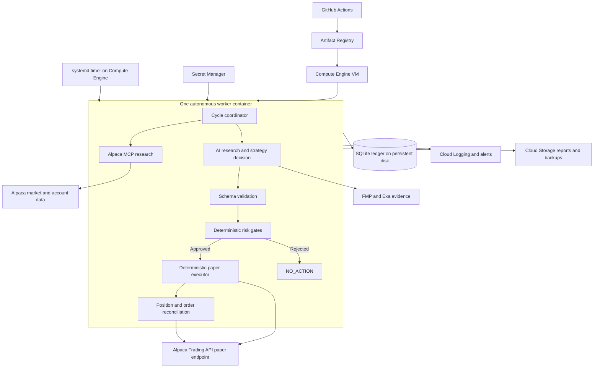
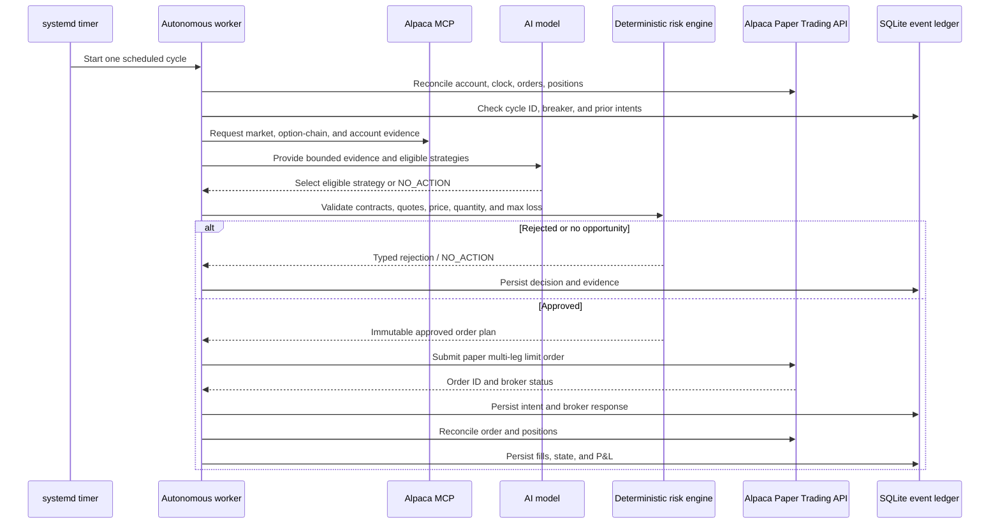
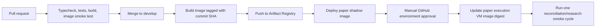

# Greeks in the Loop — GCP Architecture Plan

## Table of contents

1. [Goal and scope](#1-goal-and-scope)
2. [Recommended simple architecture](#2-recommended-simple-architecture)
3. [Autonomous control flow](#3-autonomous-control-flow)
4. [Schedule and number of runs](#4-schedule-and-number-of-runs)
5. [Strategy and position-management loop](#5-strategy-and-position-management-loop)
6. [Work required before autonomous paper orders](#6-work-required-before-autonomous-paper-orders)
7. [Deployment steps](#7-deployment-steps)
8. [CI/CD](#8-cicd)
9. [Monitoring and operational controls](#9-monitoring-and-operational-controls)
10. [One-page competition write-up](#10-one-page-competition-write-up)
11. [Hackathon delivery milestones](#11-hackathon-delivery-milestones)
12. [Post-hackathon evolution](#12-post-hackathon-evolution)

Related plan: [Minimal Local Architecture Plan](./local-architecture-plan.md)

## 1. Goal and scope

The competition goal is an autonomous AI options-trading agent that:

1. Uses Alpaca's Trading API in the paper-trading environment.
2. Uses Alpaca's MCP server or CLI.
3. Identifies options opportunities without a human initiating each cycle.
4. Applies deterministic risk controls before placing an order.
5. Manages open orders and positions after entry.
6. Produces an auditable record of decisions, orders, fills, exits, and P&L.

The simplest deployment that fits the repository today is **one containerized worker on one Google Compute Engine VM with a persistent disk**. The worker uses the repository's existing SQLite ledger, OpenCode process, Alpaca MCP server, and sequential worker lock. It is supervised by `systemd` and invoked on a fixed market-day schedule by a `systemd` timer.

This plan intentionally avoids Kubernetes, Cloud SQL, Pub/Sub, Workflows, and multiple microservices during the hackathon. Those are reasonable later, but they add deployment and failure modes without directly improving the demo.

> **Current implementation gap:** `src/index.ts` describes a non-executing research worker and explicitly disables Alpaca mutation tools. It can produce research and shadow trade intents, but it cannot currently satisfy the competition requirement to place and manage paper options trades. A deterministic execution and reconciliation stage must be implemented and tested before autonomous paper execution is enabled.

## 2. Recommended simple architecture



### Why Compute Engine instead of Cloud Run initially

The current repository assumes:

- A persistent SQLite ledger under `.state/`.
- A process-lifetime SQLite worker lock.
- A local OpenCode subprocess and MCP subprocess tree.
- A long-running or repeatedly invoked command-line worker.

A single VM preserves these assumptions with minimal code changes. Cloud Run Jobs have ephemeral local storage, so moving there safely would require replacing SQLite and its lock with a remote transactional store such as Cloud SQL PostgreSQL. That migration can follow the hackathon.

### Google Cloud components

| Component | Purpose |
|---|---|
| Compute Engine `e2-standard-2` VM | Runs the single autonomous worker with enough memory for Node, OpenCode, Python, and MCP subprocesses |
| 20–30 GB persistent disk | Stores the SQLite ledger, lock sidecar, run artifacts, and local operational state |
| Artifact Registry | Stores immutable Docker images tagged with the Git commit SHA |
| Secret Manager | Stores Alpaca, FMP, Exa, and model-provider credentials |
| Cloud Logging and Monitoring | Captures structured logs and raises failure/breaker alerts |
| Cloud Storage | Stores daily reports, demonstrations, P&L exports, and encrypted SQLite backups; it is not the runtime filesystem |
| GitHub Actions | Runs checks, builds the image, pushes it, and deploys an approved image to the VM |

Run exactly **one worker replica** for one Alpaca paper account. Horizontal scaling would risk duplicate decisions and orders.

## 3. Autonomous control flow



### Authority boundary

The AI may:

- Interpret market regime and ambiguous evidence.
- Compare only strategies made eligible by deterministic code.
- Select a candidate or return `NO_ACTION`.
- Explain supporting evidence, contradictions, and invalidation conditions.

The AI must not:

- Invent option contract symbols.
- Calculate authoritative quantity or maximum loss.
- Override quote freshness, liquidity, or portfolio limits.
- Submit, replace, cancel, or close an order directly.
- Disable a breaker.

The application resolves exact contracts and retains all financial authority. The executor consumes only a schema-validated, risk-approved order plan and calls Alpaca's paper Trading API.

## 4. Schedule and number of runs

### Recommended competition schedule

Use `America/New_York` market time and run on weekdays. The application must still consult Alpaca's calendar and return `NO_ACTION` on holidays, early-close conflicts, or stale/missing data.

| Run | Time ET | Purpose |
|---:|---:|---|
| 1 | 08:30 | Premarket evidence and regime preparation; no entry order |
| 2–26 | Every 15 minutes from 09:45 through 15:45 | Reconcile first, then research, risk-check, enter/manage/exit as eligible |
| 27 | 16:15 | End-of-day reconciliation, P&L snapshot, and report; no new entry |

**Total: 27 scheduled invocations per normal market day, 135 per five-day market week.** A holiday produces no trading work because the Alpaca calendar gate fails closed. On an early-close day, the agent must stop new entries and adapt management to Alpaca's reported close.

The 25 intraday invocations are:

```text
09:45
10:00, 10:15, 10:30, 10:45
11:00, 11:15, 11:30, 11:45
12:00, 12:15, 12:30, 12:45
13:00, 13:15, 13:30, 13:45
14:00, 14:15, 14:30, 14:45
15:00, 15:15, 15:30, 15:45
```

### Why 15 minutes

- It matches the repository's quarter-hour trade-intent slot logic.
- It is frequent enough to reconcile orders and manage a hackathon options position.
- It avoids the cost and noise of running the AI every minute.
- It provides multiple observable decisions and `NO_ACTION` outcomes for the demo.

Every invocation starts with reconciliation. A cycle should invoke the expensive AI research stage only when its slot has not already completed and when market/account prerequisites pass. If an open order or position exists, deterministic management takes priority over searching for a new trade.

### Timer definitions

Use three `systemd` timer schedules on the VM:

```ini
# Premarket
OnCalendar=Mon..Fri *-*-* 08:30:00 America/New_York

# Intraday (the worker rejects 09:30 and 16:00 if broad timer syntax includes them)
OnCalendar=Mon..Fri *-*-* 09:45:00 America/New_York
OnCalendar=Mon..Fri *-*-* 10..15:00,15,30,45:00 America/New_York

# End of day
OnCalendar=Mon..Fri *-*-* 16:15:00 America/New_York
```

Validate the exact `OnCalendar` expressions with `systemd-analyze calendar` on the chosen Linux image. An alternative is a small wrapper timer every 15 minutes from 08:30–16:15 ET, with the application deciding the cycle type; explicit schedules are preferred because they avoid unnecessary starts.

The worker must use a deterministic cycle ID such as:

```text
paper-account/session-date/slot/strategy-version
```

A unique ledger constraint must ensure that a restarted timer cannot execute the same trade intent twice.

## 5. Strategy and position-management loop

Keep the initial universe small:

- Underlyings: SPY and QQQ.
- Environment: Alpaca paper trading only.
- Initial executable strategy: directional defined-risk debit spreads.
- Later strategies: iron condors and long-volatility structures only after separate tests.

For every intraday cycle:

1. **Reconcile broker truth** — account, clock, buying power, positions, and open/recent orders.
2. **Apply operational gates** — market session, worker ownership, daily breaker, cycle idempotency, and data availability.
3. **Manage existing exposure first** — check fills, stale orders, profit targets, loss thresholds, time exits, and regime invalidation.
4. **Capture evidence** — underlying bars, indicators, option chains/Greeks, liquidity, account state, FMP context, and Exa research.
5. **Classify regime deterministically** — identify eligible strategy families.
6. **Ask the AI for bounded judgment** — choose among eligible candidates or veto all with `NO_ACTION`.
7. **Resolve exact contracts in code** — do not accept model-invented option symbols.
8. **Apply deterministic risk gates** — freshness, spread width, liquidity, max loss, reward/risk, quantity, concentration, daily limits, and duplicate checks.
9. **Submit one idempotent paper order** — multi-leg limit order with a deterministic `client_order_id`.
10. **Persist and report** — record evidence, decision, gates, broker response, fills, exits, and P&L.

To keep behavior understandable during judging, allow at most:

- 2 concurrent positions.
- 2 new entries per day.
- 1 new approved trade per scheduled cycle.
- 0.25%–0.75% account equity at risk per trade in the balanced profile.
- A 1.5% daily equity-loss breaker.

These are recommended starting limits for paper validation, not profitability claims.

## 6. Work required before autonomous paper orders

The deployment alone does not make the current worker an executing agent. Implement these items first:

### A. Deterministic executor

Add an application-owned Alpaca Trading API client that:

- Accepts only a validated approved order-plan type.
- Re-fetches quotes immediately before submission.
- Uses Alpaca's paper endpoint, `https://paper-api.alpaca.markets`.
- Submits complete multi-leg options orders as one limit order where supported.
- Generates a deterministic `client_order_id`.
- Queries Alpaca for that ID before every retry.
- Persists the request intent before submission and the broker response immediately afterward.

Do not enable the Alpaca MCP mutation tool for the AI. Using Alpaca MCP for research satisfies the MCP requirement; deterministic code should use Alpaca's Trading API for execution.

### B. Reconciliation and exits

Implement deterministic handling for:

- Submitted, accepted, partially filled, filled, rejected, canceled, and expired orders.
- Entry-order timeout and cancellation.
- Profit target, stop threshold, regime invalidation, and time-based exits.
- Unexpected or unreconciled positions.
- Restart recovery from the SQLite ledger plus current Alpaca state.

### C. Safety and idempotency

Before enabling execution, prove with tests that:

- The same cycle cannot create two intents.
- The same intent cannot create two Alpaca orders.
- A crash immediately before or after submission is recoverable.
- Missing/stale quotes produce `NO_ACTION`.
- Database, model, MCP, and broker failures fail closed.
- The daily breaker blocks new entries but still permits risk-reducing exits.

## 7. Deployment steps

### Step 1 — Add container support

Create a production Docker image containing:

- Node.js 22 and pnpm 10.33.0.
- Python 3.10+ and `uv`/`uvx`.
- `zsh` and CA certificates.
- OpenCode and pinned MCP dependencies.
- Compiled application output from `pnpm build`.
- A non-root runtime user.

Install MCP packages during image build rather than downloading them with `npx -y` or `uvx` during a market cycle. Keep all versions pinned.

### Step 2 — Create GCP resources

1. Create an Artifact Registry Docker repository.
2. Create one `e2-standard-2` Compute Engine VM in a US region.
3. Attach a 20–30 GB persistent disk and mount it at `/var/lib/greeks`.
4. Install Docker and the Google Cloud Ops Agent.
5. Create a `greeks-agent` service account with least-privilege Secret Manager and logging access.
6. Store Alpaca paper, FMP, Exa, and model credentials in Secret Manager.
7. Create a private GCS bucket for reports and encrypted daily backups.
8. Restrict VM SSH access through IAP and disable public password login.

### Step 3 — Configure runtime state

Persist these outside the container:

```text
/var/lib/greeks/.state/
/var/lib/greeks/workspace/
/var/lib/greeks/reports/
```

Mount them into the container. Set `RESEARCH_LEDGER_PATH` to the persistent ledger location. Never bake `.env` or credentials into the image.

Use a startup script to read secrets securely and pass them as container environment variables. Ensure secrets are not printed by shell tracing or logs.

### Step 4 — Install the supervised one-shot service

Create a `systemd` service that:

1. Pulls or runs one immutable image digest.
2. Mounts `/var/lib/greeks` into the container.
3. Executes one cycle.
4. Sets a hard timeout slightly above `AGENT_CYCLE_TIMEOUT_MS`.
5. Does not start a second instance while one is active.
6. Sends stdout/stderr to journald and Cloud Logging.

Use the repository's normal one-cycle mode for scheduled sessions. Add explicit CLI modes or environment values for `premarket`, `intraday`, and `end-of-day` if the application does not yet distinguish them.

### Step 5 — Install and verify timers

1. Install the premarket, intraday, and end-of-day timers.
2. Confirm the VM timezone behavior and timer expansion.
3. Run an anytime research-only cycle.
4. Run an anytime shadow cycle with the isolated shadow ledger.
5. Observe at least one full market day with execution disabled.
6. Enable deterministic paper execution only after idempotency and reconciliation tests pass.

### Step 6 — Backups and reports

At 17:00 ET each market day:

1. Stop/avoid overlap with a worker cycle.
2. Use SQLite's online backup API or `VACUUM INTO`; do not copy a live database file blindly.
3. Upload the dated backup and daily report to GCS.
4. Apply bucket retention and lifecycle policies.
5. Test restoration before relying on the backup.

## 8. CI/CD

### Pull requests

GitHub Actions should run:

```bash
pnpm install --frozen-lockfile
pnpm typecheck
pnpm test
pnpm build
docker build ...
```

PR jobs must not receive Alpaca or model-provider secrets.

### Deployment flow



Use GitHub Actions Workload Identity Federation instead of a long-lived GCP service-account key.

Recommended triggers:

- Pull request: validation only.
- Push to `develop`: build and deploy to shadow mode.
- Version tag or manual dispatch: deploy the exact tested image digest to paper execution after approval.

A custom webhook is unnecessary. GitHub Actions already reacts to repository events. The deployment job can connect through IAP/OS Login or update VM instance metadata to the approved image digest, then restart only after confirming no cycle is active.

Do not deploy application code to GCS. Push container images to Artifact Registry; use GCS only for artifacts and backups.

## 9. Monitoring and operational controls

Create alerts for:

- No successful scheduled cycle during market hours.
- Cycle failure or timeout.
- Five consecutive failures or latched loop breaker.
- SQLite persistence or worker-lock failure.
- Trade intent approved/rejected.
- Alpaca order rejected or left unresolved.
- Unexpected/partially filled position.
- Broker state not matching ledger state.
- Daily loss breaker reached.
- Open position close to the session end.

Required controls:

- `EXECUTION_ENABLED=false` by default.
- Paper endpoint assertion at startup and immediately before order submission.
- Manual kill switch that blocks entries but permits exits.
- Daily entry and loss limits.
- One worker and one account-level lease.
- Structured logs with credential redaction.

## 10. One-page competition write-up

### AI logic

Greeks in the Loop is an autonomous, regime-aware options agent for Alpaca paper trading. On a fixed market-day schedule, it reconciles the paper account, captures current market and options evidence through Alpaca MCP, and supplements the evidence with FMP and Exa. Deterministic code classifies the market and exposes only eligible defined-risk strategy families. The AI interprets ambiguous evidence, identifies contradictions, selects one eligible candidate, or returns `NO_ACTION`. Exact option contracts are resolved and checked by application code; the AI cannot invent symbols, quantities, prices, or risk values.

The initial executable playbook is a directional SPY or QQQ debit spread because its maximum loss is bounded and easy to explain. Every run records the market snapshot, AI rationale, rejected alternatives, invalidation conditions, and final action. The same worker manages existing positions before looking for a new entry, making the system autonomous across opportunity discovery, entry, monitoring, and exit.

### Risk gates

Every trade must pass deterministic gates for market session, data freshness, option identity, expiration, bid/ask width, liquidity, net debit, spread width, maximum loss, reward-to-risk, buying power, account concentration, daily loss, concurrent positions, and duplicate orders. The balanced paper profile risks 0.25%–0.75% of equity per trade, allows at most two positions and two new entries per day, and stops new entries after a 1.5% daily equity loss. A rejected gate produces a typed reason and `NO_ACTION`; prompts cannot override a gate. An idempotent cycle ID and Alpaca `client_order_id` prevent duplicate trades after retries or restarts. Reconciliation against Alpaca broker truth occurs before every decision and after every order transition.

### Alpaca infrastructure implementation

Alpaca MCP supplies paper-account context, market data, option chains, and Greeks to the research agent, satisfying the required autonomous MCP workflow. Approved orders are submitted by deterministic application code through Alpaca's paper Trading API, keeping financial authority outside the model. A single Compute Engine worker runs 27 scheduled cycles per normal market day: one premarket preparation run, 25 quarter-hour intraday runs from 09:45–15:45 ET, and one end-of-day reconciliation run. SQLite on persistent disk records the complete lifecycle, Cloud Logging exposes operation and failures, and GCS stores daily reports and backups. GitHub Actions validates, packages, and deploys immutable images to Artifact Registry using short-lived GCP identity.

## 11. Hackathon delivery milestones

1. **Research demo:** existing autonomous research and shadow risk run reliably on the VM.
2. **Executor:** one deterministic SPY/QQQ debit-spread paper order can be generated from a validated intent.
3. **Lifecycle:** the worker reconciles fills and applies deterministic exits after restart.
4. **Safety:** duplicate, stale-data, breaker, and outage tests pass.
5. **Autonomy:** timers run an entire paper-trading day without manual prompts.
6. **Evidence:** the final demo shows opportunity evidence, AI decision, risk-gate output, Alpaca order/fill, exit, and resulting P&L from the ledger.

## 12. Post-hackathon evolution

Move to Cloud Run Jobs only when the SQLite ledger and local worker lock have been replaced with Cloud SQL PostgreSQL or another transactional distributed store. At that point, Cloud Scheduler can invoke one-shot jobs directly, and a separate event-driven reconciliation service can handle broker updates. This migration is deliberately deferred so the hackathon architecture remains simple, inspectable, and aligned with the repository's current implementation.
