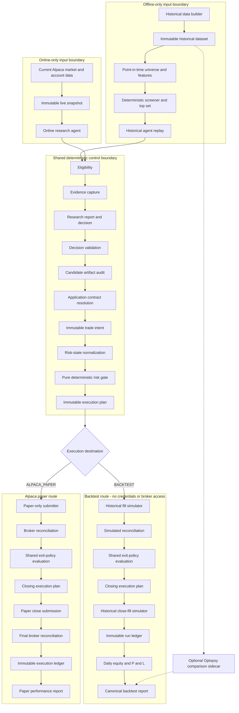
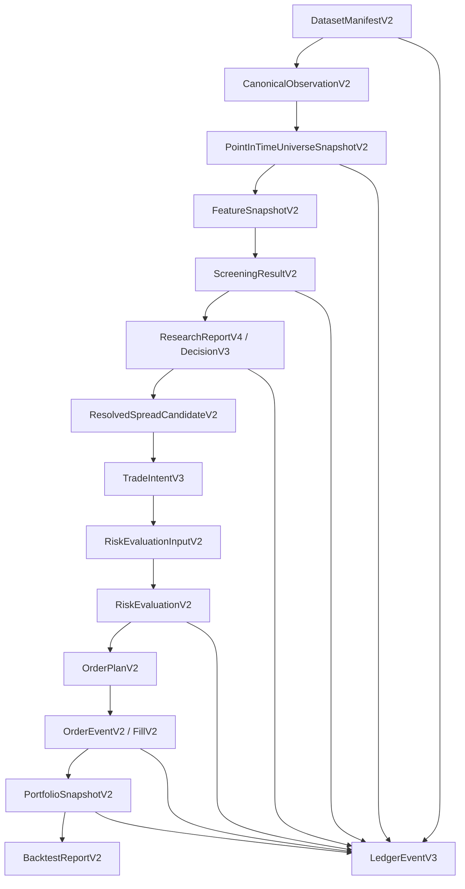

# Backtesting V2 Plan — Historical Options Chain and Autonomous Agent Replay

## Table of contents

1. [Purpose](#1-purpose)
2. [Decision-grade claim and evidence tiers](#2-decision-grade-claim-and-evidence-tiers)
3. [V2 architecture](#3-v2-architecture)
4. [Inputs](#4-inputs)
5. [Golden universe and dataset](#5-golden-universe-and-dataset)
   - [Historical SQLite database](#57-historical-sqlite-database)
   - [Schemas between layers](#58-schemas-between-layers)
6. [Point-in-time data rules](#6-point-in-time-data-rules)
7. [Backtest methodology](#7-backtest-methodology)
8. [Agent-replay methodology](#8-agent-replay-methodology)
9. [Contract selection and strategy rules](#9-contract-selection-and-strategy-rules)
10. [Execution, costs, and lifecycle modeling](#10-execution-costs-and-lifecycle-modeling)
11. [Outputs](#11-outputs)
12. [Metrics and competition alignment](#12-metrics-and-competition-alignment)
13. [Walk-forward, holdout, and overfitting controls](#13-walk-forward-holdout-and-overfitting-controls)
14. [Difference from deterministic replay V1](#14-difference-from-deterministic-replay-v1)
15. [Alpaca tooling and data acquisition](#15-alpaca-tooling-and-data-acquisition)
    - [Current market-data capability boundary](#151-current-srcmarket-data-capability-boundary)
    - [Market-data availability and failure policy](#152-market-data-availability-and-failure-policy)
16. [Proposed repository design](#16-proposed-repository-design)
17. [Runnable CLI workflows and configuration](#17-runnable-cli-workflows-and-configuration)
18. [Implementation phases](#18-implementation-phases)
19. [Acceptance gates](#19-acceptance-gates)
20. [Known limitations](#20-known-limitations)
21. [References](#21-references)

## 1. Purpose

Backtesting V2 should answer the competition question:

> Can the autonomous agent identify options opportunities, make bounded decisions, manage positions, and generate paper-trading P&L through Alpaca under realistic data, execution, and risk assumptions?

V2 is not only a payoff calculator. It must test the complete causal chain:

```text
Point-in-time market and context data
        ↓
Deterministic universe screening
        ↓
Autonomous agent decision or NO_ACTION
        ↓
Application-owned contract resolution and risk gates
        ↓
Latency-aware multi-leg order simulation
        ↓
Position monitoring and deterministic exits
        ↓
Portfolio P&L, drawdown, attribution, and audit
```

The preferred method is **historical chain replay** using actual historical option bid/ask observations and synchronized underlying data. End-of-day portfolio research is a useful secondary analysis. Synthetic pricing is allowed only as a clearly labeled sensitivity test and must not support the primary profitability claim.

V2 should preserve the current architecture's authority boundary:

- The AI interprets evidence, selects among application-eligible candidates, or returns `NO_ACTION`.
- Deterministic code owns point-in-time eligibility, contract identity, quotes, economics, sizing, risk approval, order simulation, portfolio accounting, and exits.
- The same risk and lifecycle rules should be shared by backtest, paper, and eventual live paths.

## 2. Decision-grade claim and evidence tiers

Not every historical data source can support the same claim. Every V2 run must declare an evidence tier.

| Tier | Required evidence | Permitted claim |
|---|---|---|
| `EXACT_CHAIN_REPLAY` | Point-in-time contract universe, historical option bid/ask and timestamps, synchronized underlying data, contract metadata, and causal signal inputs | Primary contract-selection, execution-simulation, and P&L evidence |
| `BAR_PROXY_REPLAY` | Underlying history plus partial option bars or sampled option observations | Signal, exit-mechanics, and broad sensitivity evidence; not exact fill or selection evidence |
| `EOD_PORTFOLIO_RESEARCH` | Complete daily chains with daily liquidity fields and portfolio accounting | Daily/weekly strategy research and cross-sectional comparisons; not intraday execution claims |
| `SYNTHETIC_PRICING` | Underlying, rates, dividends, and an explicit volatility/model process | Preliminary stress and unit testing only; not evidence of attainable historical P&L |
| `AGENT_FIXTURE_REPLAY` | Frozen, timestamped historical tool responses and historical context available at the decision instant | Autonomous-agent behavior, policy adherence, tool use, and decision reproducibility |

The headline competition result should come from `EXACT_CHAIN_REPLAY` when coverage permits. All lower-fidelity observations and all transitions between tiers must be visible in the output; the engine must not silently replace missing quotes with theoretical prices.

Two result tracks must remain separate:

1. **Strategy/execution track:** deterministic replay of frozen decisions and historical chains. This is the primary P&L evidence.
2. **Agent-behavior track:** replay of frozen historical tool fixtures through the research agent. This demonstrates autonomy and safety but is model/version dependent.

A current web search performed today cannot be used as evidence in a historical cycle. Exa, FMP, news, filings, and other contextual responses must be captured with publication/availability timestamps and frozen before agent replay.

## 3. V2 architecture

The selected design is an Alpaca-native, locally authoritative options backtester that shares decision, validation, risk, execution-plan, exit-policy, and accounting contracts with the online paper route. Data and execution authority remain route-specific.



### 3.1 Shared and distinct authority

Both routes share:

- Eligibility and evidence contracts.
- Research report/decision schemas and validation.
- Candidate artifact audit.
- Strategy definitions and deterministic contract resolution.
- Risk-state normalization and pure risk evaluation.
- Immutable entry and closing execution-plan contracts.
- Position, ledger, exit-policy, accounting, and metric definitions.

They intentionally differ in:

| Concern | Backtest | Alpaca paper |
|---|---|---|
| Clock | Historical replay clock | Trusted current market clock |
| Evidence | Frozen historical dataset and fixtures | Current Alpaca/FMP/Exa observations |
| Agent mode | Frozen decision or model against frozen fixtures | Current research invocation |
| Fill authority | Declared deterministic simulator | Alpaca broker acknowledgements and fills |
| Position authority | Replayed portfolio state | Broker-reconciled state |
| Credentials | Forbidden | Paper credentials only |
| Main uncertainty | Data and execution assumptions | Broker order and fill behavior |

### 3.2 Hard security invariant

The backtest process must not:

- Read `.env` or Secret Manager broker credentials.
- Instantiate the Alpaca paper submitter.
- Import a module whose initialization can submit orders.
- Reach Alpaca Trading API mutation endpoints.
- Change an execution-plan destination from `BACKTEST` to `ALPACA_PAPER`.

Enforce this structurally with separate entry points and dependency injection, not only an environment flag. CI should run the backtester with Alpaca credentials absent and a network-deny test around broker hosts. The paper adapter must assert the paper endpoint and reject any plan whose destination is not `ALPACA_PAPER`.

### 3.3 External comparison engines

Optopsy is an optional independent economic comparator. It may consume exported normalized data and configuration and return comparison artifacts, but it is not authoritative for:

- Candidate identity.
- Risk approval.
- Fill or exit semantics.
- Portfolio capital reservation.
- Project P&L.

Because Optopsy is AGPL-licensed, prefer a separately invoked process or sidecar and review distribution obligations before integration. Do not copy its implementation into this repository without a licensing decision.

LEAN's separation of universe selection, data feed, algorithm, execution, portfolio, and brokerage models remains a useful validation pattern. V2 does not need to embed LEAN or Optopsy for the MVP.[^lean-universe][^lean-history]

## 4. Inputs

Every backtest run must be fully identified by one immutable experiment manifest.

### 4.1 Experiment identity

```ts
interface BacktestExperimentV2 {
  backtestVersion: "2.0.0"
  experimentId: string
  createdAt?: string
  codeCommit?: string
  capability: "SELECTION_PREFLIGHT" | "HISTORICAL_CHAIN_REPLAY"
  strategyVersion: string
  researchPromptVersion?: string
  decisionContractVersion?: string
  riskRuleVersion?: string
  monitorRuleVersion?: string
  datasetManifestRef: string
  universeManifestRef?: string
  replaySelection: {
    startDate: string // inclusive YYYY-MM-DD
    endDate: string // inclusive YYYY-MM-DD
    timezone: "America/New_York"
    symbols: string[]
    session: "REGULAR"
    decisionTimes: string[] // HH:mm New York time
  }
  executionModel: ExecutionModelV2
  portfolioPolicy: PortfolioPolicyV2
  evaluationPlan?: EvaluationPlanV2
  randomSeed?: number
}
```

A result without code, data, configuration, and model identity is not reproducible and must be marked incomplete. The implementation may allow reduced metadata only for a `SELECTION_PREFLIGHT`, which cannot report fills or P&L.

The acquisition range, actual dataset coverage, and replay range are distinct:

```text
requested replay range ⊆ validated dataset coverage ⊆ requested acquisition range
requested replay symbols ⊆ covered dataset symbols ⊆ requested universe
```

`startDate` and `endDate` are inclusive exchange-session dates. The command must fail before replay if the requested range or symbols are not covered; it must never silently broaden the selection.

### 4.2 Historical market inputs

Required for each underlying and timestamp as applicable:

- Completed underlying daily bars for trend, return, and realized-volatility features.
- Completed underlying intraday bars and/or quotes for VWAP, spot, and timing.
- Point-in-time option contract definitions, including original OCC symbol, underlying, call/put, strike, expiration, multiplier, exercise style, settlement, and deliverable.
- Historical option bid, ask, bid size, ask size, trades, and timestamps.
- Option volume and open interest with their actual observation dates.
- Historical Greeks and implied volatility only when their source and availability time are known; otherwise derive them under a versioned model and label them `DERIVED`.
- Alpaca market calendar, regular-session hours, holidays, and early closes.
- Splits, dividends, symbol changes, mergers, spin-offs, and option-contract adjustments.
- Interest-rate data when pricing, carry, or exercise logic uses it.
- Relevant benchmark series.

The primary replay requires historical bid/ask data, not only last trades or bar closes.

### 4.3 Context and agent inputs

For agent-fixture replay:

- Frozen Alpaca MCP responses.
- Frozen FMP responses with observation and retrieval times.
- Frozen Exa/news/filing results with publication and retrieval times.
- Trusted-time response.
- Account, positions, orders, buying power, and options approval fixture.
- Session eligibility supplied by application code.
- The exact system prompt, cycle prompt, skill, output schema, model provider, model ID, and inference settings.
- Prior research context available at that historical instant.

Context published after the decision instant is forbidden even if it describes an earlier event.

### 4.4 Strategy inputs

The initial V2 executable strategy remains a directional defined-risk debit vertical:

- `BULL_CALL_SPREAD` for qualified bullish regimes.
- `BEAR_PUT_SPREAD` for qualified bearish regimes.
- `NO_ACTION` for mixed, stale, illiquid, conflicting, or unsupported conditions.

Versioned parameters include:

- Decision times.
- Daily and intraday lookbacks.
- Regime thresholds.
- DTE bounds.
- Long- and short-leg delta bands.
- Minimum volume and open interest.
- Maximum absolute and relative bid/ask spread.
- Spread-width bounds.
- Maximum debit as a proportion of width.
- Profit target, stop, trend invalidation, maximum holding period, and expiration exit.
- Maximum risk per trade, daily loss, concurrent positions, and entries per day.

### 4.5 Execution inputs

Execution is a separate replaceable model with:

- Signal-to-submission latency.
- Maximum quote age and maximum leg timestamp difference.
- Parent multi-leg order type and time in force.
- Limit-price construction.
- Fill model and price-improvement assumptions.
- Partial-fill and no-fill policy.
- Cancellation/replacement timeout.
- Commission, exchange, regulatory, and contract fees.
- Slippage and spread-stress multipliers.
- Maximum order size relative to quote size and volume.
- Assignment, exercise, expiration, and settlement model.

### 4.6 Portfolio inputs

- Initial equity and cash.
- Buying-power and margin assumptions.
- Risk profile.
- Maximum concurrent positions and correlated exposure.
- Position-sizing rule.
- Treatment of cash yield.
- Treatment of assigned stock.
- Daily breaker state.
- Existing positions and orders at replay start.

## 5. Golden universe and dataset

### 5.1 Frozen candidate universe

The supplied golden universe contains **48 symbols**, not 51:

```text
AAPL, ADBE, ADI, ADSK, ALAB, AMAT, AMD, APP,
ARM, ASML, AVGO, CDNS, CRWD, CRWV, DASH, DDOG,
FTNT, GOOG, GOOGL, INTC, INTU, KLAC, LITE, LRCX,
MCHP, META, MPWR, MRVL, MSFT, MSTR, MU, NBIS,
NVDA, NXPI, PANW, PDD, PLTR, QCOM, ROP, SHOP,
SNDK, SNPS, STX, TER, TRI, TXN, WDAY, WDC
```

The list is a **candidate universe**, not proof that every symbol has usable options observations on every historical date. The manifest must preserve this exact list as `golden-tech-options-v1`, while point-in-time eligibility determines which symbols can enter each cycle.

### 5.2 Point-in-time eligibility

A symbol is eligible at time `t` only if:

1. The equity was listed and tradable at `t`.
2. Alpaca or the approved vendor identifies options contracts listed at `t`.
3. Required underlying history exists without future-filled values.
4. A complete chain or sufficient candidate-contract observations exist for the decision time.
5. Corporate-action and contract metadata are resolvable.
6. Quotes pass validity, freshness, synchronization, and liquidity gates.
7. The symbol was in the frozen research universe before evaluating the holdout period.

Recent listings, relistings, symbol changes, and dual share classes require explicit handling. `GOOG` and `GOOGL` are separate securities but highly correlated exposures; portfolio and evaluation reports must group them under a common issuer factor. The engine must not backfill pre-listing history or use today's option universe to reconstruct prior dates.

### 5.3 Dataset layers

Use three immutable layers:

```text
raw/
  Vendor-native responses partitioned by source/date/symbol
normalized/
  Canonical contracts, quotes, bars, actions, and calendars
features/
  Versioned causal features and candidate-screen results
```

Recommended storage:

- Parquet for large quote/bar/chain partitions.
- DuckDB for local analytical queries over Parquet.
- SQLite for manifests, experiment metadata, event ledgers, and compact fixtures.
- JSON for schemas, experiment configuration, and portable reports.

The current repository does not include a historical downloader or dataset store. These are V2 deliverables, not existing capabilities.

### 5.4 Dataset manifest

Each dataset release must include:

```json
{
  "datasetVersion": "golden-tech-options-v1",
  "createdAt": "...",
  "sources": [],
  "requestedSymbols": [],
  "coveredSymbols": [],
  "uncoveredSymbols": [],
  "start": "...",
  "end": "...",
  "partitions": [],
  "qualitySummary": {},
  "contentHashes": []
}
```

Per-symbol coverage should report:

- First and last underlying observation.
- First and last options observation.
- Trading sessions expected and present.
- Quote, trade, volume, open-interest, and Greek coverage.
- Number of valid point-in-time chains.
- Number and reason for excluded sessions.
- Corporate actions and adjusted contracts.

### 5.5 Golden test subsets

The full 48-symbol dataset is the competition universe. Smaller frozen subsets should support fast tests:

| Subset | Purpose |
|---|---|
| `golden-smoke-v1` | One liquid symbol, two sessions, one bullish, one bearish/no-action fixture; unit and CI testing |
| `golden-lifecycle-v1` | Hand-verified entries, exits, stale quotes, no fills, expiration, and corporate-action cases |
| `golden-agent-v1` | Frozen MCP/context fixtures with expected policy and schema outcomes |
| `golden-tech-options-v1` | Full 48-symbol walk-forward and holdout evaluation |

Fixtures must be selected before looking at final holdout performance. Hand-verifiable cases should include expected chain membership, contract selection, limit price, fill, cash flow, and exit P&L.

### 5.6 Research-agent universe migration

`src/research/research-agent-system.md` currently requires exactly `SPY`, `QQQ`, and `IWM` indicators and permits proposals only for those three underlyings. Expanding the prompt alone is insufficient.

The migration must version and update together:

- `src/research/research-agent-system.md`.
- Research decision/report schemas and builders.
- Underlying and option-identity validation.
- Symbol-indicator cardinality and ranking rules.
- Behavior-evaluation fixtures and expected MCP calls.
- Strategy eligibility and candidate selector.
- Risk concentration logic.
- Documentation and generated examples.

The agent should not research all 48 chains expensively on every cycle. Deterministic code should compute point-in-time features for all eligible symbols, rank them, and provide a bounded top set—recommended top 5—to the agent. The agent may select at most one candidate or `NO_ACTION`. The report must retain the full screened universe, exclusions, ranking version, and top-set handoff.

### 5.7 Historical SQLite database

#### Existing database inventory

Two different SQLite concerns must not be conflated:

1. **Operational event ledger:** the repository currently creates `.state/research-ledger.sqlite` plus `.state/research-ledger.sqlite.worker-lock.sqlite`. The authoritative table is `ledger_events`; it stores research-cycle lifecycle events and durable breaker state. It is not a historical quotes/chains database.
2. **Historical market database:** no historical `.sqlite`, `.sqlite3`, or `.db` file is currently discoverable under the project tree. If one exists outside the repository, its path and schema must be supplied and profiled before V2 can claim compatibility.

The worker-lock sidecar is never a dataset and must not be opened as one. The existing research ledger should remain readable and immutable under its current migrations; V2 should not add quote/bar tables to it.

#### Intake policy for an existing historical SQLite file

Treat an existing database as a read-only source until it passes an intake process:

1. Open with SQLite URI `mode=ro` or `sqlite3 -readonly`.
2. Record file size, SQLite version, `PRAGMA user_version`, page size, journal mode, and integrity result.
3. Record the complete `sqlite_schema` SQL and a deterministic schema hash.
4. Record table and index names, row counts, minimum/maximum timestamps, symbols, and null/duplicate rates.
5. Determine timestamp units and timezone semantics; never infer milliseconds versus nanoseconds from magnitude alone without validation.
6. Determine whether timestamps mean market event time, bar completion, vendor publication, or local ingestion.
7. Determine whether expired/adjusted contracts and delisted symbols are retained.
8. Determine whether bid/ask records are quote events, quote bars, or end-of-period snapshots.
9. Determine feed/vendor, entitlement, adjustment, and correction policies.
10. Create a versioned adapter and validation report; never rewrite the original database in place.

Useful read-only inspection commands are:

```bash
sqlite3 -readonly /path/to/historical.sqlite '.tables'
sqlite3 -readonly /path/to/historical.sqlite '.schema'
sqlite3 -readonly /path/to/historical.sqlite 'PRAGMA integrity_check;'
sqlite3 -readonly /path/to/historical.sqlite \
  "SELECT type, name, tbl_name, sql FROM sqlite_schema ORDER BY type, name;"
```

A dataset is accepted only if `PRAGMA integrity_check` returns `ok` and the V2 adapter can prove the required point-in-time semantics. A structurally valid SQLite file can still be unusable for causal options replay.

#### Recommended storage decision

Use SQLite as a first-class V2 input when the existing database already contains normalized, indexed historical records and is small enough for repeatable local replay. For the full 48-symbol quote-level dataset:

- Keep the original SQLite database immutable.
- Create a manifest containing its file hash and schema hash.
- Query through a read-only `HistoricalDataStoreV2` adapter.
- Add only indexes in a separate normalized copy, never in the source artifact.
- Optionally export validated partitions to Parquet for scan-heavy analytics.
- Keep experiment metadata and event ledgers in separate SQLite databases.

Recommended files:

```text
workspace/backtest-v2/datasets/
  source/
    historical-options.sqlite       # immutable vendor/source artifact
  normalized/
    historical-options-v2.sqlite    # optional normalized/indexed copy
  manifests/
    historical-options-v2.json
workspace/backtest-v2/runs/<run-id>/
  event-ledger.sqlite               # run lifecycle only
```

#### Recommended normalized historical schema

The following schema is a proposed V2 compatibility target, not a claim about an existing database. Monetary values use integers; timestamps are UTC ISO 8601 with millisecond precision unless the schema explicitly stores epoch nanoseconds. Every causal observation has both `observed_at` and `available_at`.

```sql
CREATE TABLE dataset_metadata (
  dataset_id TEXT PRIMARY KEY,
  schema_version TEXT NOT NULL,
  normalization_version TEXT NOT NULL,
  created_at TEXT NOT NULL,
  source_manifest_json TEXT NOT NULL,
  content_hash TEXT NOT NULL UNIQUE
) STRICT;

CREATE TABLE securities (
  security_id TEXT PRIMARY KEY,
  symbol TEXT NOT NULL,
  issuer_factor_id TEXT NOT NULL,
  asset_class TEXT NOT NULL CHECK (asset_class = 'US_EQUITY'),
  listed_at TEXT NOT NULL,
  delisted_at TEXT,
  source TEXT NOT NULL,
  UNIQUE (source, symbol, listed_at)
) STRICT;

CREATE TABLE option_contracts (
  contract_id TEXT PRIMARY KEY,
  security_id TEXT NOT NULL REFERENCES securities(security_id),
  source TEXT NOT NULL,
  source_contract_symbol TEXT NOT NULL,
  option_root TEXT NOT NULL,
  option_type TEXT NOT NULL CHECK (option_type IN ('CALL', 'PUT')),
  strike_thousandths_per_share INTEGER NOT NULL CHECK (strike_thousandths_per_share > 0),
  expiration_date TEXT NOT NULL,
  exercise_style TEXT NOT NULL CHECK (exercise_style IN ('AMERICAN', 'EUROPEAN', 'OTHER')),
  settlement_type TEXT NOT NULL,
  multiplier INTEGER NOT NULL CHECK (multiplier > 0),
  deliverable_json TEXT NOT NULL,
  adjusted INTEGER NOT NULL CHECK (adjusted IN (0, 1)),
  listed_at TEXT NOT NULL,
  delisted_at TEXT,
  corporate_action_lineage_id TEXT,
  UNIQUE (source, source_contract_symbol, listed_at)
) STRICT;

CREATE TABLE market_sessions (
  session_date TEXT PRIMARY KEY,
  open_at TEXT NOT NULL,
  close_at TEXT NOT NULL,
  early_close INTEGER NOT NULL CHECK (early_close IN (0, 1)),
  source TEXT NOT NULL,
  CHECK (open_at < close_at)
) STRICT;

CREATE TABLE underlying_bars (
  security_id TEXT NOT NULL REFERENCES securities(security_id),
  timeframe TEXT NOT NULL,
  bar_start_at TEXT NOT NULL,
  bar_end_at TEXT NOT NULL,
  available_at TEXT NOT NULL,
  open_micros INTEGER NOT NULL,
  high_micros INTEGER NOT NULL,
  low_micros INTEGER NOT NULL,
  close_micros INTEGER NOT NULL,
  volume INTEGER NOT NULL,
  trade_count INTEGER,
  vwap_micros INTEGER,
  source TEXT NOT NULL,
  feed TEXT NOT NULL,
  source_sequence TEXT NOT NULL DEFAULT '',
  PRIMARY KEY (security_id, timeframe, bar_start_at, source, feed, source_sequence),
  CHECK (bar_start_at < bar_end_at),
  CHECK (bar_end_at <= available_at)
) WITHOUT ROWID, STRICT;

CREATE TABLE option_quotes (
  contract_id TEXT NOT NULL REFERENCES option_contracts(contract_id),
  observed_at TEXT NOT NULL,
  available_at TEXT NOT NULL,
  bid_milli_cents_per_share INTEGER NOT NULL,
  ask_milli_cents_per_share INTEGER NOT NULL,
  bid_size INTEGER,
  ask_size INTEGER,
  exchange_bid TEXT,
  exchange_ask TEXT,
  source TEXT NOT NULL,
  feed TEXT NOT NULL,
  source_sequence TEXT NOT NULL,
  quality_flags INTEGER NOT NULL DEFAULT 0,
  PRIMARY KEY (contract_id, observed_at, source, feed, source_sequence),
  CHECK (observed_at <= available_at),
  CHECK (bid_milli_cents_per_share >= 0),
  CHECK (ask_milli_cents_per_share > 0),
  CHECK (ask_milli_cents_per_share >= bid_milli_cents_per_share)
) WITHOUT ROWID, STRICT;

CREATE TABLE option_trades (
  contract_id TEXT NOT NULL REFERENCES option_contracts(contract_id),
  observed_at TEXT NOT NULL,
  available_at TEXT NOT NULL,
  price_milli_cents_per_share INTEGER NOT NULL,
  size INTEGER NOT NULL,
  exchange TEXT,
  conditions_json TEXT NOT NULL,
  source TEXT NOT NULL,
  feed TEXT NOT NULL,
  source_sequence TEXT NOT NULL,
  PRIMARY KEY (contract_id, observed_at, source, feed, source_sequence),
  CHECK (observed_at <= available_at),
  CHECK (price_milli_cents_per_share > 0),
  CHECK (size > 0)
) WITHOUT ROWID, STRICT;

CREATE TABLE option_daily_statistics (
  contract_id TEXT NOT NULL REFERENCES option_contracts(contract_id),
  session_date TEXT NOT NULL REFERENCES market_sessions(session_date),
  available_at TEXT NOT NULL,
  volume INTEGER,
  open_interest INTEGER,
  open_interest_as_of_date TEXT,
  source TEXT NOT NULL,
  PRIMARY KEY (contract_id, session_date, source)
) WITHOUT ROWID, STRICT;

CREATE TABLE option_greeks (
  contract_id TEXT NOT NULL REFERENCES option_contracts(contract_id),
  observed_at TEXT NOT NULL,
  available_at TEXT NOT NULL,
  delta_micros INTEGER,
  gamma_micros INTEGER,
  theta_micros INTEGER,
  vega_micros INTEGER,
  implied_volatility_micros INTEGER,
  provenance TEXT NOT NULL CHECK (provenance IN ('VENDOR', 'DERIVED')),
  model_version TEXT,
  input_snapshot_ref TEXT,
  source TEXT NOT NULL,
  PRIMARY KEY (contract_id, observed_at, source, provenance),
  CHECK (observed_at <= available_at),
  CHECK (provenance = 'VENDOR' OR model_version IS NOT NULL)
) WITHOUT ROWID, STRICT;

CREATE TABLE corporate_actions (
  action_id TEXT PRIMARY KEY,
  security_id TEXT NOT NULL REFERENCES securities(security_id),
  action_type TEXT NOT NULL,
  ex_date TEXT NOT NULL,
  announced_at TEXT,
  available_at TEXT NOT NULL,
  details_json TEXT NOT NULL,
  source TEXT NOT NULL
) STRICT;

CREATE INDEX option_contracts_underlying_expiration
  ON option_contracts(security_id, expiration_date, listed_at, delisted_at);
CREATE INDEX option_quotes_causal_lookup
  ON option_quotes(contract_id, available_at, observed_at);
CREATE INDEX option_quotes_cross_section
  ON option_quotes(available_at, contract_id);
CREATE INDEX option_daily_statistics_lookup
  ON option_daily_statistics(contract_id, session_date, available_at);
CREATE INDEX underlying_bars_causal_lookup
  ON underlying_bars(security_id, timeframe, available_at, bar_end_at);
```

`quality_flags` should be a versioned bit mask for conditions such as stale, locked, crossed, zero bid, missing size, corrected, or proxy-derived data. The normalized database may retain invalid raw observations with flags, but candidate selection must use a validated view rather than silently deleting evidence.

Recommended causal views:

```sql
CREATE VIEW valid_option_quotes_v2 AS
SELECT *
FROM option_quotes
WHERE bid_milli_cents_per_share > 0
  AND ask_milli_cents_per_share > bid_milli_cents_per_share
  AND quality_flags = 0;
```

The actual quality policy remains versioned application configuration; a view is a convenience, not the final financial authority.

#### Relationship to the existing event ledger

Reuse the existing ledger's design principles:

- Append-only events.
- Monotonic sequence.
- Correlation and causation.
- Immutable migrations and checksums.
- `occurred_at` distinct from `recorded_at`.
- Payload size and credential-safety checks.

Do not reuse its current event union or research-cycle-only database triggers for backtest order/position streams. Backtesting should add a new event contract/store version with `run_id`, `stream_type`, and `stream_id`, or use a separate run ledger whose physical schema is optimized for those fields.

### 5.8 Schemas between layers

Schemas are the central V2 safety boundary. Every layer parses its input and emits a new immutable contract; layers do not pass unvalidated vendor objects or model prose downstream.



#### Boundary 1 — Dataset manifest

```ts
type DatasetManifestV2 = Readonly<{
  manifestVersion: "2.0.0"
  datasetId: string
  createdAt: string
  schemaHash: string
  contentHash: string
  sourceFiles: readonly Readonly<{
    uri: string
    byteLength: number
    sha256: string
    sqliteUserVersion?: number
  }>[]
  sources: readonly Readonly<{
    provider: string
    feed: string
    entitlement: string
    retrievedAt: string
    availabilitySemantics: string
  }>[]
  requestedSymbols: readonly string[]
  coveredSymbols: readonly string[]
  partiallyCoveredSymbols: readonly string[]
  uncoveredSymbols: readonly string[]
  firstSessionDate: string
  lastSessionDate: string
  partitions: readonly DatasetPartitionV2[]
  qualitySummary: DatasetQualitySummaryV2
  limitations: readonly string[]
}>
```

The manifest, not the SQLite filename, identifies the dataset. Any content or schema change creates a new hash and dataset ID.

#### Boundary 2 — Canonical observations

Minimum strict contracts:

```ts
type SecurityIdentityV2 = Readonly<{
  identityVersion: "2.0.0"
  securityId: string
  symbol: string
  issuerFactorId: string
  listedAt: string
  delistedAt?: string
}>

type OptionContractIdentityV2 = Readonly<{
  identityVersion: "2.0.0"
  contractId: string
  underlyingSecurityId: string
  source: string
  sourceContractSymbol: string
  optionRoot: string
  optionType: "CALL" | "PUT"
  strikeThousandthsPerShare: number
  expirationDate: string
  exerciseStyle: "AMERICAN" | "EUROPEAN" | "OTHER"
  settlementType: string
  multiplier: number
  deliverable: readonly DeliverableComponentV2[]
  adjusted: boolean
  listedAt: string
  delistedAt?: string
  corporateActionLineageId?: string
}>

type OptionQuoteObservationV2 = Readonly<{
  observationVersion: "2.0.0"
  observationId: string
  contractId: string
  observedAt: string
  availableAt: string
  bidMilliCentsPerShare: number
  askMilliCentsPerShare: number
  bidSize?: number
  askSize?: number
  source: string
  feed: string
  qualityFlags: readonly QuoteQualityFlagV2[]
}>
```

The canonical `contractId` must not be only the display/OCC symbol because adjusted deliverables and symbol lineage can change historical meaning.

#### Boundary 3 — Point-in-time universe

```ts
type PointInTimeUniverseSnapshotV2 = Readonly<{
  snapshotVersion: "2.0.0"
  snapshotId: string
  datasetId: string
  universePolicyVersion: string
  sessionDate: string
  decisionAt: string
  availabilityCutoff: string
  requestedSecurityIds: readonly string[]
  eligibleSecurityIds: readonly string[]
  exclusions: readonly Readonly<{
    securityId: string
    reasonCodes: readonly UniverseExclusionReasonV2[]
  }>[]
  contractRefsBySecurity: Readonly<Record<string, readonly string[]>>
  contentHash: string
}>
```

The frozen 48-symbol list is policy input. Eligibility and contract membership are snapshot output.

#### Boundary 4 — Features

```ts
type FeatureSnapshotV2 = Readonly<{
  featureVersion: "2.0.0"
  snapshotId: string
  universeSnapshotRef: string
  securityId: string
  asOf: string
  availableAt: string
  inputObservationRefs: readonly string[]
  values: Readonly<{
    closeMicros?: number
    sma20Micros?: number
    sma50Micros?: number
    sessionVwapMicros?: number
    spotMidpointMicros?: number
    return5dMicros?: number
    return20dMicros?: number
    realizedVolatility20Micros?: number
    completedSessionVolumeRatio20Micros?: number
  }>
  completeness: "COMPLETE" | "PARTIAL" | "UNAVAILABLE"
  issueCodes: readonly FeatureIssueCodeV2[]
  contentHash: string
}>
```

Use fixed-point values for deterministic rankings and retain exact input references.

#### Boundary 5 — Screening and top-set handoff

```ts
type ScreeningResultV2 = Readonly<{
  screeningVersion: "2.0.0"
  screeningId: string
  universeSnapshotRef: string
  featureSnapshotRefs: readonly string[]
  evaluatedAt: string
  ranked: readonly Readonly<{
    rank: number
    securityId: string
    direction: "BULLISH" | "BEARISH"
    regimeScoreMicros: number
    liquidityScoreMicros: number
    stableRankingTuple: readonly (number | string)[]
    eligibleCandidateRefs: readonly string[]
  }>[]
  rejected: readonly Readonly<{
    securityId: string
    reasonCodes: readonly ScreeningReasonCodeV2[]
  }>[]
  topSetCandidateRefs: readonly string[]
  policyVersion: string
  contentHash: string
}>
```

This is application-owned. The AI receives bounded candidate references and explanatory fields rather than 48 unbounded chains.

#### Boundary 6 — Research-agent output, grounded in `src/contracts`

The current model output is `ResearchReportV3` from `src/contracts/research-report-v3.ts`:

```text
ResearchReportV3
  reportVersion = 3.0.0
  result = ResearchDecisionV2 | PreliminaryResearchV2
  analysis = account checks + market regime + symbol indicators
             + candidate diagnostics + external context + factors/conflicts
```

Its nested contracts are:

- `ResearchDecisionV2` from `src/contracts/research-decision-v2.ts`.
- `PreliminaryResearchV2` from `src/contracts/preliminary-research-v2.ts`.
- `ResearchCandidateV2`, which contains exact underlying, expiration, strikes, and Alpaca option symbols.
- Evidence graphs with sourced facts and inferences.

Important current constraints:

- Underlyings are limited by `ALLOWED_OPTION_UNDERLYINGS_V1 = ["SPY", "QQQ", "IWM"]`.
- `symbolIndicators` must contain exactly three entries and ranks 1–3.
- Proposal and candidate diagnostics use `allowedAlpacaOptionSymbolV1Schema`.
- Proposals require exact symbols authored in model output.
- Proposal evidence references an application-owned snapshot and is freshness-validated.
- `TradeIntentV2` then independently refreshes and verifies exact quotes and economics.

These contracts must remain readable for existing artifacts. Do not widen the V2/V3 literals in place. Introduce:

```ts
type ResearchDecisionV3 =
  | Readonly<{
      contractVersion: "3.0.0"
      outcome: "NO_ACTION"
      reasonCodes: readonly NoActionReasonCodeV3[]
      evidence: EvidenceGraphV2
    }>
  | Readonly<{
      contractVersion: "3.0.0"
      outcome: "PROPOSE_TRADE"
      direction: "BULLISH" | "BEARISH"
      screenedUniverseRef: string
      selectedCandidateRef: string
      thesis: string
      invalidation: readonly string[]
      evidence: EvidenceGraphV2
    }>

type PreliminaryResearchV3 = Readonly<{
  contractVersion: "3.0.0"
  outcome: "PRELIMINARY_RESEARCH"
  targetSessionDate: string
  direction: "BULLISH" | "BEARISH" | "UNDETERMINED"
  screenedUniverseRef: string
  selectedCandidateRef?: string
  thesis: string
  invalidation: readonly string[]
  evidence: EvidenceGraphV2
  requiresRefresh: true
}>

type ResearchReportV4 = Readonly<{
  reportVersion: "4.0.0"
  result: ResearchDecisionV3 | PreliminaryResearchV3
  analysis: Readonly<{
    provenance: "AGENT_REPORTED" | "FIXTURE_REPLAY"
    asOf: string
    accountChecksRef: string
    marketRegimeRef: string
    screenedUniverseRef: string
    topSetRef: string
    selectedCandidateDiagnosticsRef?: string
    externalContextRefs: readonly string[]
    supportingFactors: readonly string[]
    contradictingFactors: readonly string[]
    conflicts: readonly string[]
  }>
}>
```

This preserves the strongest existing ideas—strict discriminated outcomes, bounded evidence, explicit `NO_ACTION`, temporal checks, and application-owned snapshots—while removing model authority over contract identity and the exactly-three-symbol array.

A compatibility adapter may replay existing `ResearchReportV3` artifacts only for `SPY`/`QQQ`/`IWM`. New 48-symbol experiments use `ResearchReportV4`.

Before deterministic contract resolution, run a new `CandidateArtifactAuditV1`:

```ts
type CandidateArtifactAuditV1 = Readonly<{
  auditVersion: "1.0.0"
  auditId: string
  decisionRef: string
  researchReportRef: string
  datasetId: string
  screenedUniverseRef: string
  evidenceSnapshotRefs: readonly string[]
  auditedAt: string
  outcome: "PASSED" | "REJECTED"
  reasonCodes: readonly CandidateArtifactAuditReasonV1[]
  checks: Readonly<{
    hashesMatch: boolean
    timestampsCausal: boolean
    evidenceInDataset: boolean
    candidateInTopSet: boolean
    decisionSchemaValid: boolean
    noFutureEvidence: boolean
  }>
  inputHash: string
}>
```

The audit verifies artifact identity, dataset membership, causal timestamps, evidence references, candidate membership in the deterministic top set, and absence of future evidence. It does not approve financial risk or infer a fill. A failed audit terminates the path before contract resolution.

#### Boundary 7 — Resolved candidate and trade intent

```ts
type ResolvedSpreadCandidateV2 = Readonly<{
  candidateVersion: "2.0.0"
  candidateId: string
  screeningResultRef: string
  underlyingSecurityId: string
  direction: "BULLISH" | "BEARISH"
  structure: "BULL_CALL_SPREAD" | "BEAR_PUT_SPREAD"
  longContractRef: string
  shortContractRef: string
  longQuoteRef: string
  shortQuoteRef: string
  evaluatedAt: string
  dte: number
  selectorPolicyVersion: string
  liquidityDiagnostics: Readonly<Record<string, number>>
  rankingTuple: readonly (number | string)[]
  contentHash: string
}>

type TradeIntentV3 = Readonly<{
  contractVersion: "3.0.0"
  decisionContractVersion: "3.0.0"
  candidateRef: string
  evaluatedAt: string
  direction: "BULLISH" | "BEARISH"
  structure: "BULL_CALL_SPREAD" | "BEAR_PUT_SPREAD"
  legs: readonly [
    Readonly<{ role: "LONG"; contractRef: string; quoteRef: string }>,
    Readonly<{ role: "SHORT"; contractRef: string; quoteRef: string }>
  ]
  economicsPolicyVersion: string
  entryLimitMilliCentsPerShare: number
  widthMilliCentsPerShare: number
  maximumLossCentsPerUnit: number
  maximumProfitCentsPerUnit: number
  exitPolicyRef: string
  inputHash: string
}>
```

`src/contracts/trade-intent-v2.ts` remains the compatibility contract for standard 100-share indicative-feed contracts. Its quote freshness checks, exact symbol cross-checks, and derived-economics validation should inspire V3, but V3 must support historical source provenance, canonical contract references, and explicit multipliers/deliverables.

#### Boundary 8 — Risk

```ts
type RiskEvaluationInputV2 = Readonly<{
  inputVersion: "2.0.0"
  mode: "OPPORTUNITY_REPLAY" | "PORTFOLIO_REPLAY" | "PAPER"
  evaluatedAt: string
  intent: TradeIntentV3
  riskPolicyRef: string
  accountStateRef: string
  portfolioStateRef: string
  contractSnapshotRef: string
  sessionStateRef: string
  inputHash: string
}>

type RiskEvaluationV2 =
  | Readonly<{
      evaluationVersion: "2.0.0"
      outcome: "APPROVED"
      evaluatedAt: string
      policyVersion: string
      approvedQuantity: number
      reservedMaximumLossCents: number
      projectedBuyingPowerCents: number
      inputHash: string
    }>
  | Readonly<{
      evaluationVersion: "2.0.0"
      outcome: "REJECTED"
      evaluatedAt: string | null
      policyVersion: string
      reasonCodes: readonly RiskRejectionReasonV2[]
      inputHash?: string
    }>
```

The existing `RiskEvaluationInputV1` and evaluator remain a regression oracle and compatibility path for quantity-one, standard 100-share contracts under the current fixed policy. Multi-symbol concentration, position sizing, and parameterized competition profiles require genuine V2 contracts rather than silently changing V1 behavior.

#### Boundary 9 — Shared execution plan, exits, and fills

`TradeIntentV3` remains a non-executable pre-risk object. Only an approved `RiskEvaluationV2` may produce an immutable `ExecutionPlanV1`. This new contract starts at V1 because no persisted execution-plan contract currently exists; the overall product name “Backtesting V2” does not require every new wire contract to start at version 2.

```ts
type ExitPolicyV1 = Readonly<{
  policyVersion: "1.0.0"
  profitTargetBps?: number
  stopLossBps?: number
  maximumHoldingMinutes?: number
  exitDte?: number
  closeShortBeforeExpirationMinutes: number
  closeOnTrendInvalidation: boolean
  endOfTest: "LIQUIDATE_AT_END" | "MARK_TO_MARKET"
  priority: readonly ExitReasonV1[]
}>

type ExecutionPlanV1 = Readonly<{
  planVersion: "1.0.0"
  planId: string
  intentRef: string
  riskEvaluationRef: string
  purpose: "OPEN" | "CLOSE"
  destination: "BACKTEST" | "ALPACA_PAPER"
  createdAt: string
  validAfter: string
  validUntil: string
  clientOrderId: string
  strategy: "BULL_CALL_SPREAD" | "BEAR_PUT_SPREAD"
  underlyingSecurityId: string
  orderClass: "MLEG"
  orderType: "LIMIT"
  timeInForce: "DAY"
  quantity: number
  limitMilliCentsPerShare: number
  legs: readonly ExecutionLegV1[]
  reservedMaximumLossCents: number
  exitPolicy: ExitPolicyV1
  evidenceHash: string
  riskInputHash: string
  inputQuoteRefs: readonly string[]
  contentHash: string
}>

type FillV1 = Readonly<{
  fillVersion: "1.0.0"
  fillId: string
  planId: string
  occurredAt: string
  availableAt: string
  quantity: number
  netPriceMilliCentsPerShare: number
  legFills: readonly LegFillV1[]
  fees: FeeBreakdownV1
  simulated: boolean
  modelVersion: string
  sourceQuoteRefs: readonly string[]
}>
```

The same `ExecutionPlanV1` shape is used for opening and closing plans. The destination is immutable and included in the content hash. The backtest adapter accepts only `BACKTEST`; the Alpaca adapter accepts only `ALPACA_PAPER`.

A broker-specific `AlpacaOrderRequestV1` and a simulator-specific `SimulatedOrderRequestV1` are derived adapters, not shared authority contracts. Order and fill events form a state machine; reports must not infer fills directly from final positions.

`ExitPolicyV1` is evaluated by the same pure function in both routes. It returns `HOLD` or a reason-coded closing-plan request. Priority is mandatory because profit, stop, invalidation, DTE, breaker, and test/session-end conditions can be true simultaneously.

#### Boundary 10 — Portfolio and lifecycle

```ts
type PortfolioSnapshotV2 = Readonly<{
  snapshotVersion: "2.0.0"
  snapshotId: string
  runId: string
  asOf: string
  cashCents: number
  equityCents: number
  buyingPowerCents: number
  reservedMaximumLossCents: number
  realizedPnlCents: number
  unrealizedPnlCents: number
  positions: readonly PositionV2[]
  openOrderRefs: readonly string[]
  issuerFactorRisk: Readonly<Record<string, number>>
  breakers: Readonly<{
    daily: "CLEAR" | "LATCHED"
    competition: "CLEAR" | "LATCHED"
  }>
  inputHash: string
}>
```

Every position mark references executable quote observations. Assignment, exercise, expiration, and unpriced exits are explicit settlement/lifecycle events.

#### Boundary 11 — Canonical output

```ts
type BacktestReportV2 = Readonly<{
  reportVersion: "2.0.0"
  runId: string
  status: "COMPLETE" | "INCOMPLETE" | "FAILED"
  incompleteReasonCodes: readonly string[]
  experimentRef: string
  datasetId: string
  datasetHash: string
  policyHashes: Readonly<Record<string, string>>
  evidenceTier: string
  evaluationFold: string
  universeCoverage: UniverseCoverageV2
  dataQuality: DatasetQualitySummaryV2
  decisions: DecisionMetricsV2
  execution: ExecutionMetricsV2
  portfolio: PortfolioMetricsV2
  risk: RiskMetricsV2
  benchmarks: readonly BenchmarkResultV2[]
  robustness: RobustnessSummaryV2
  artifacts: readonly ArtifactRefV2[]
  reproducibilityHash: string
}>
```

A report is `INCOMPLETE` if any required exit is unpriced, a required dataset partition is missing, or lifecycle accounting cannot reconcile. Partial metrics may be retained but cannot be promoted to the headline competition result.

#### Schema implementation rules

- Implement strict Zod schemas next to exported TypeScript types.
- Give every persisted boundary an explicit semantic version literal.
- Use discriminated unions for outcomes and event state transitions.
- Use bounded identifiers and bounded arrays.
- Use integer fixed-point monetary values; never store authoritative money as SQLite `REAL`.
- Preserve `observedAt`, `availableAt`, and `recordedAt` as distinct concepts.
- Store large chains/feature sets externally and reference them by immutable ID plus SHA-256.
- Parse at every I/O boundary; do not cast JSON with `as` and trust it downstream.
- Never modify an existing contract literal or historical migration in place.
- Add compatibility adapters explicitly and record when they are used.
- Generate JSON Schema from Zod where cross-language Python ingestion needs validation, and test TypeScript/Python fixtures against the same golden examples.

## 6. Point-in-time data rules

V2 must enforce these causal rules mechanically:

1. **Completed data only:** a bar close, volume, high, or low is unavailable until the bar completes.
2. **Availability timestamps:** observation time and availability/publication time are distinct when necessary.
3. **No current-universe reconstruction:** expired and delisted contracts come from historical listings, not today's contract endpoint.
4. **No future open interest:** use the dated value actually available at the decision time.
5. **No future Greeks:** vendor or derived Greeks must declare their input timestamps and model version.
6. **Synchronized legs:** reject or explicitly classify multi-leg quotes outside the allowed time tolerance.
7. **Quote quality:** reject missing, nonpositive, locked/crossed, stale, or economically impossible quotes under versioned rules.
8. **Corporate-action lineage:** adjusted contracts must preserve multiplier and deliverable changes.
9. **Historical context only:** no current Exa/FMP/news query may stand in for information available historically.
10. **Decision latency:** an observation used at `t` cannot receive a fill at `t`; submission and fill eligibility occur after configured latency.
11. **No same-bar look-ahead:** a decision based on a completed 10:00–10:01 bar can be submitted only after 10:01 under the configured latency.
12. **Immutable source data:** normalized corrections create a new dataset version rather than mutating an old manifest.

The engine must emit typed rejection or exclusion reasons for every failed rule.

## 7. Backtest methodology

### 7.1 Historical decision schedule

Replay the intended production cadence in `America/New_York`:

- 08:30 ET premarket context preparation, with no entry.
- Every 15 minutes from 09:45 through 15:45 ET for reconciliation, screening, entry eligibility, and position management.
- 16:15 ET end-of-day reconciliation, with no new entry.

This is 27 scheduled invocations per normal session, including 25 intraday decision/management slots. Alpaca's historical calendar remains authoritative for holidays and early closes.

For computational efficiency, every intraday slot runs deterministic reconciliation and screening, but the AI is invoked only when:

- No hard account/portfolio gate has already failed.
- At least one symbol passes minimum data and liquidity screening.
- The slot has not already been processed.
- A new agent decision is required rather than deterministic position management.

### 7.2 Chronological event loop

For each session and decision slot:

1. Reconstruct broker/account state from prior replay events.
2. Apply session, account, breaker, concurrency, and idempotency gates.
3. Process open-order timeouts and position exits before considering entries.
4. Load only observations available by the decision cutoff.
5. Compute causal features for the eligible 48-symbol subset.
6. Rank symbols deterministically and retain the top set.
7. Obtain a frozen agent decision or run an agent-fixture evaluation.
8. Validate the decision contract.
9. Resolve exact contracts from the historical chain.
10. Refresh quotes at the post-decision timestamp.
11. Evaluate the same deterministic risk gate used in paper operation.
12. Build an immutable order plan with a deterministic client order ID.
13. Submit to the historical execution simulator after configured latency.
14. Process fills, partial fills, cancellations, and position updates chronologically.
15. Persist every lifecycle event to an append-only replay ledger.
16. Mark positions at executable liquidation values, not optimistic midpoints.
17. Continue monitoring until deterministic exit, expiration, or replay end.

Equal-timestamp event ordering must be explicit and versioned, for example:

```text
market data arrival
→ broker/order update
→ risk/position monitor
→ strategy decision
→ order submission
→ fill eligibility
```

### 7.3 Separate research and portfolio simulations

V2 should expose two related runs:

- **Opportunity replay:** evaluates every eligible signal independently to understand strategy distributions by symbol, regime, DTE, and time.
- **Portfolio replay:** enforces shared cash, buying power, position limits, correlated exposure, entries per day, and the daily breaker.

Only portfolio replay supports the headline account-equity and competition P&L claim. Opportunity replay is diagnostic and must not be presented as simultaneously attainable P&L.

### 7.4 Determinism

With identical code, dataset manifest, configuration, model output fixture, and seed, a replay must produce byte-stable canonical output or a documented canonical hash. If the live LLM is rerun, that run belongs to the agent-behavior evaluation and must not overwrite the frozen primary P&L result.

## 8. Agent-replay methodology

Historical P&L and LLM evaluation have different reproducibility properties. V2 should support three agent modes:

| Mode | Behavior | Use |
|---|---|---|
| `FROZEN_DECISION` | Load a previously validated decision artifact | Primary deterministic P&L replay |
| `FIXTURE_AGENT` | Run the versioned agent against frozen historical MCP/context responses | Autonomy, policy, schema, and decision-quality evaluation |
| `LIVE_MODEL_EXPERIMENT` | Run the current model against frozen fixtures and record a new experiment | Model comparison only; never silently replace benchmark results |

Agent evaluation should measure:

- Correct tool-call sequence and hard-gate short-circuiting.
- Attempts to call forbidden mutation tools.
- Schema-valid response rate.
- `NO_ACTION` precision on blocked/insufficient-evidence fixtures.
- Proposal validity and agreement with deterministic eligibility.
- Candidate selection stability across repeated runs.
- Evidence provenance and temporal correctness.
- Token use, latency, and cost per eligible decision.
- Contradiction discovery rather than confirmation-only behavior.

The deterministic screener must retain all ranked candidates so the agent's selection or veto can be compared with rule-only baselines.

## 9. Contract selection and strategy rules

The initial V2 selector should implement the bounded directional debit-spread design described in the Alpaca research deck. The first authoritative MVP supports only `BULL_CALL_SPREAD` and `BEAR_PUT_SPREAD`, matching the current `ResearchDecisionV2`, `TradeIntentV2`, economics, and risk path. Long single-leg options and defined-risk credit spreads remain planned extensions after the debit-spread portfolio and accounting invariants pass.

This intentionally rejects an immediate six-strategy MVP. Adding `LONG_CALL`, `LONG_PUT`, `BULL_PUT_SPREAD`, and `BEAR_CALL_SPREAD` would require new payoff, credit, short-leg, assignment, buying-power, exit, and risk contracts before the shared paper/backtest parity claim would be true.

The debit-spread selector should:

1. Determine bullish, bearish, mixed, or unavailable regime from completed data.
2. Enumerate contracts only from the point-in-time chain.
3. Require 14–30 DTE.
4. Use calls for bullish spreads and puts for bearish spreads.
5. Target absolute long-leg delta 0.45–0.60.
6. Target absolute short-leg delta 0.20–0.35.
7. Require same underlying, expiration, option type, and valid strike ordering.
8. Require width from $1 through $10 unless the strategy version overrides it.
9. Require volume at least 100 and open interest at least 500 per leg when those fields are causally available.
10. Require acceptable quote age, synchronization, bid/ask spread, and quoted size.
11. Require positive debit below spread width and no greater than 60% of width.
12. Rank eligible spreads deterministically.

Suggested stable ranking tuple:

```text
abs(DTE - 21)
→ total delta-target distance
→ relative bid/ask cost
→ spread width
→ expiration
→ long OCC symbol
→ short OCC symbol
```

All monetary comparisons use integer cents or finer fixed-point units. The AI may select among application-supplied eligible identities but cannot author contract symbols, quotes, debit, maximum loss, quantity, or broker parameters.

The selector must report coverage and rejection reasons, not only the winning spread.

## 10. Execution, costs, and lifecycle modeling

### 10.1 Required execution scenarios

Every strategy result should be computed under at least these execution models:

| Model | Assumption | Interpretation |
|---|---|---|
| `GROSS_THEORETICAL` | No spread cost, fees, or slippage | Diagnostic upper bound only |
| `IMMEDIATE_MARKETABLE` | Buy at ask, sell at bid, plus fees | Conservative immediately executable baseline |
| `LIMIT_MODELED` | Parent spread limit with calibrated fill/no-fill logic | Expected paper/live operating model |
| `STRESSED` | 1.5–2× spread/slippage/fees and reduced size | Liquidity and implementation-risk test |

A midpoint scenario may be reported only as sensitivity analysis. It cannot be the sole or headline net result. Research on options transaction costs shows that both naive full-spread and frictionless midpoint assumptions can misstate effective costs; any price-improvement model must be calibrated from observed fills rather than copied from an aggregate paper estimate.[^muravyev-pearson][^transaction-costs]

### 10.2 Multi-leg execution

Represent each spread as:

- One parent order and strategy intent.
- Two individual option legs.
- An aggregate net debit/credit and limit.
- Per-leg quotes, sizes, timestamps, and fills.

Default paper/live parity assumes one Alpaca `mleg` limit order. The simulator should support:

- Atomic parent fill.
- No fill before timeout.
- Partial/leg-level outcomes only when the chosen broker model permits them.
- Cancellation and replacement.
- Late-fill handling.
- Idempotent retries.

It must not independently grant both legs favorable fills at unrelated times and call the result an atomic spread fill.

### 10.3 Costs

Attribute explicitly:

- Quoted spread cost.
- Price improvement.
- Slippage.
- Commission.
- Exchange/regulatory/contract fees.
- Cancellation/replacement cost where modeled.
- Assignment/exercise fees where applicable.
- Opportunity cost from no fills.

Report gross-to-net reconciliation for every trade and aggregate run.

### 10.4 Position lifecycle

Track:

- Parent and leg order states.
- Contract-level lots.
- Cash, buying power, and reserved maximum loss.
- Realized and unrealized P&L.
- Delta, gamma, vega, and theta when available or derived.
- Profit target.
- Stop threshold.
- Trend/regime invalidation.
- Maximum holding period.
- Exit before expiration.
- Expiration, exercise, assignment, and resulting shares.
- Daily and portfolio breaker state.

Exit evaluation uses executable closing quotes. Missing exit quotes produce a typed incomplete result; V2 must not silently use the last stale midpoint.

### 10.5 Accounting equations and end-of-test policy

Use signed transaction cash flow so the accounting generalizes without strategy-specific P&L shortcuts.

For a leg fill:

- `priceHalfCents` is an integer where one unit equals $0.005 per share.
- `multiplier` and `quantity` are positive integers.
- `sideSign` is `+1` for a sell and `-1` for a buy.

```text
legCashFlowCents =
  sideSign × priceHalfCents × multiplier × quantity / 2
```

The product must divide exactly by two or use a finer canonical price unit; authoritative cash flow may not be silently rounded.

```text
transactionCashFlowCents =
  sum(legCashFlowCents)
  - commissionsCents
  - regulatoryFeesCents
```

Round-trip P&L is the sum of all signed entry and exit cash flows after all fees. Fees must not be subtracted twice: either fills are gross and fee events are separate, or fill cash flows are net with one declared convention.

Liquidation valuation is conservative:

```text
long option liquidation value  = bid × multiplier × quantity
short option liquidation value = -ask × multiplier × quantity

equity = cash + liquidation value of all open positions
net P&L = equity - initial capital - net external cash flows
```

Daily values:

```text
daily P&L = equity[t] - equity[t-1] - external flow[t]
daily return = (equity[t] - external flow[t]) / equity[t-1] - 1
```

The default MVP end policy is `LIQUIDATE_AT_END`:

1. Stop creating new entries before the final liquidation window.
2. Build a closing `ExecutionPlanV1` for every open position.
3. Fill against valid executable closing quotes under the selected execution model.
4. Release reserved capital only after closing reconciliation.
5. Require zero open positions at completion.
6. Reconcile `ending cash = initial capital + cumulative realized net P&L` when no external flows exist.

If any required final close lacks a valid quote, the run is `INCOMPLETE`; the option is not valued at zero and the open position is not silently discarded. `MARK_TO_MARKET` may be a diagnostic policy but cannot provide the primary forced-close P&L claim.

### 10.6 Global chronological simulator

Process one merged event stream across all symbols and positions:

```text
MARKET_SNAPSHOT
→ DECISION
→ ARTIFACT_AUDIT
→ RISK_RESULT
→ CAPITAL_RESERVATION
→ ENTRY_PLAN
→ ENTRY_FILL
→ POSITION_MARK
→ EXIT_DECISION
→ CLOSING_PLAN
→ CLOSE_FILL
→ DAILY_SNAPSHOT
→ TEST_END
```

For equal timestamps use a versioned stable key such as:

```text
(timestamp, eventPriority, securityId, strategyId, contractTuple, decisionId)
```

The simulator must prove:

- Reserved capital cannot be reused.
- `maxConcurrentPositions` cannot be bypassed by equal-timestamp decisions.
- No future quote affects an earlier decision or fill.
- Position state derives from fills, not plans.
- Replaying identical canonical input produces byte-identical ledger output.

## 11. Outputs

### 11.1 Run manifest

Every run writes:

```text
backtest-runs/<experiment-id>/
  notes.md
  strategy-spec.json
  experiment.json
  config.json
  dataset-manifest.json
  fingerprint.sha256
  raw-refs/
  normalized-refs/
  decisions.jsonl
  audit-results.jsonl
  ledger.jsonl
  event-ledger.sqlite
  trades.parquet
  round-trips.parquet
  orders.parquet
  fills.parquet
  equity.parquet
  daily-pnl.parquet
  exposures.parquet
  exclusions.parquet
  warnings.json
  canonical-report.json
  summary.md
  charts/
```

### 11.2 Canonical report

The canonical JSON should include:

- Run, code, strategy, prompt, model, risk, monitor, execution, and dataset versions.
- Evidence tier and data-quality summary.
- Universe requested, eligible, covered, and excluded.
- Session and decision-slot counts.
- Agent decisions and reason-code distribution.
- Candidate, order, fill, position, and exit counts.
- Gross and net P&L with cost attribution.
- Portfolio equity and drawdown metrics.
- Risk-limit and breaker events.
- Results by symbol, issuer factor, regime, DTE, delta, entry time, and exit reason.
- Benchmark comparisons.
- Walk-forward folds and holdout designation.
- Parameter-search inventory and overfitting diagnostics.
- Known limitations and incomplete scenarios.
- Reproducibility hashes.

### 11.3 Trade-level output

Each simulated position records:

- Decision and intent IDs.
- Underlying and issuer factor.
- Direction and structure.
- Exact leg identities and metadata.
- Signal, submission, fill, and exit timestamps.
- Quotes used and their ages.
- Limit and fill prices.
- Quantity and maximum loss.
- Risk-gate input and verdict.
- Entry and exit reasons.
- Gross P&L, every cost component, and net P&L.
- Maximum favorable/adverse excursion.
- Holding duration and DTE.
- Agent evidence/artifact references.
- Lifecycle anomalies.

### 11.4 Human report

The Markdown/HTML report should tell the competition story:

```text
Opportunities observed
→ decisions made
→ NO_ACTION and rejection reasons
→ approved defined-risk positions
→ order/fill quality
→ autonomous management and exits
→ resulting P&L and drawdown
```

It should show representative winning, losing, rejected, no-fill, stale-data, and `NO_ACTION` cases—not only the best trade.

## 12. Metrics and competition alignment

The competition objective is not simply maximum historical return. Metrics must show P&L generation, autonomous decision quality, position management, and safe use of Alpaca infrastructure.

### 12.1 Primary scoreboard

| Metric | Why it matters |
|---|---|
| Net P&L and account return | Directly measures the competition's P&L objective after modeled implementation costs |
| Maximum drawdown and drawdown duration | Shows whether returns were earned within survivable risk |
| Return on maximum capital at risk | Appropriate for defined-risk options and more meaningful than premium alone |
| Profit factor and expectancy per completed position | Shows repeatability rather than dependence on one winner |
| Net P&L by out-of-sample fold | Demonstrates performance beyond the development period |
| P&L after `IMMEDIATE_MARKETABLE` and `STRESSED` costs | Tests whether apparent edge survives realistic execution |
| Benchmark-relative return and drawdown | Distinguishes strategy value from simply owning a rising technology basket |

CAGR and annualized Sharpe should be secondary when the available options history is short. Always report the raw sample length and number of independent positions.

### 12.2 Autonomous opportunity and decision metrics

| Metric | Why it matters |
|---|---|
| Eligible decision slots | Denominator for autonomous activity |
| Symbols screened and chains successfully reconstructed | Demonstrates breadth and data availability |
| Proposal, preliminary research, and `NO_ACTION` rates | Shows agent selectivity and behavior |
| Reason-code distribution | Makes inactivity and risk rejection explainable |
| Validated proposal rate | Measures useful agent output rather than raw model output |
| Invalid/schema-rejected decision rate | Measures agent reliability |
| Hard-gate short-circuit rate | Shows cheap deterministic controls prevent waste and unsafe research |
| Tool success/error/omission rate | Demonstrates actual Alpaca MCP and context use |
| Evidence coverage and timestamp validity | Shows decisions are grounded in causal observations |
| Candidate stability across repeated fixture runs | Measures model nondeterminism and operational consistency |
| AI latency, tokens, and cost per validated decision | Measures practical autonomous operation |

### 12.3 Trading and lifecycle metrics

- Candidate signals, orders attempted, fills, no fills, partial fills, and rejections.
- Fill rate and time to fill.
- Entry/exit slippage and spread capture.
- Quote age and leg timestamp mismatch.
- Completed positions and open/unresolved positions.
- Win rate, average/median win and loss, payoff ratio, profit factor, and expectancy.
- Holding-time distribution.
- P&L and count by exit reason.
- Maximum favorable and adverse excursion.
- Assignment, exercise, expiration, cancellation, replacement, and late-fill counts.
- Restart/idempotency recoveries and duplicate orders prevented.

### 12.4 Risk metrics

- Maximum loss budgeted versus realized loss.
- Risk per trade and aggregate portfolio risk.
- Concurrent positions and issuer/underlying concentration.
- Daily breaker activations and prevented entries.
- VaR and CVaR/expected shortfall with method, horizon, and confidence level disclosed.
- Worst trade, day, week, and month.
- Return skewness, tail ratio, and downside deviation.
- Exposure by delta, gamma, vega, and theta when data supports it.
- Buying-power utilization and capital utilization.

### 12.5 Execution-cost metrics

- Gross P&L.
- Bid/ask drag.
- Slippage.
- Price improvement.
- Fees and commissions.
- Net P&L.
- Cost per contract and completed position.
- Difference among gross, immediate-marketable, modeled-limit, and stressed outcomes.
- Percentage of gross edge consumed by costs.

The gross-to-net waterfall is mandatory. Research summarized by OptionMetrics reports that many option signals can disappear after transaction costs, making cost sensitivity central rather than optional.[^transaction-costs]

### 12.6 Data-quality metrics

- Missing and stale quote rates.
- Locked/crossed/invalid market rates.
- Unmatched-leg rate.
- Missing contract and corporate-action metadata.
- Sessions and symbols excluded by reason.
- Exact-chain versus proxy coverage.
- Inferred versus observed Greek coverage.
- Signals lost because no executable spread existed.

Attractive returns accompanied by poor quote coverage or frequent fallback pricing are not credible.

### 12.7 Benchmark metrics

Compare with:

- Equal-weight and capitalization-aware returns for the eligible underlying universe.
- Buy-and-hold SPY/QQQ as broad references.
- A rules-based options benchmark with similar economic exposure when applicable, using official Cboe benchmark index data and documented methodology.[^cboe]

Report excess return, beta, correlation, tracking error, information ratio, up/down capture, and relative drawdown only when their statistical assumptions are stated.

## 13. Walk-forward, holdout, and overfitting controls

### 13.1 Freeze the split before final evaluation

After dataset coverage is known, record a versioned chronological split before inspecting holdout results:

- **Development:** earliest approximately 40% of eligible sessions.
- **Walk-forward calibration/validation:** next approximately 35%.
- **Untouched holdout:** final approximately 25%.
- **Prospective paper period:** subsequent real-time competition sessions, never backfilled into historical selection.

If the acquired history begins around February 2024, exact date boundaries must be chosen from available sessions and frozen in `evaluation-plan-v1.json`. Do not adjust boundaries after observing performance.

### 13.2 Walk-forward process

For each fold:

1. Fit or select allowed parameters using earlier data only.
2. Freeze the strategy and execution assumptions.
3. Evaluate the next chronological block.
4. Advance the window without leaking future observations.
5. Aggregate only after preserving per-fold results.

Avoid repeatedly tuning the LLM prompt on holdout failures. Prompt versions are strategy variants and count toward the search inventory.

### 13.3 Parameter and model search ledger

Record every attempted variation of:

- Universe and top-K screening.
- Feature definitions and thresholds.
- DTE and delta ranges.
- Liquidity filters.
- Entry slots.
- Profit targets, stops, and holding periods.
- Fill and slippage models.
- Risk sizing.
- Prompt, skill, model, and agent policy.

Report all variants, not only the winner. Bailey et al. show why selecting the best result from many trials can create backtest overfitting; V2 should use parameter-neighborhood stability and, where sample size permits, Probability of Backtest Overfitting or a comparable multiple-testing analysis.[^bailey-pbo]

### 13.4 Required robustness tests

- Buy ask/sell bid execution.
- Spread, fees, and slippage at 1.5× and 2×.
- Added one- and five-minute decision latency.
- Stricter quote-age and leg-synchronization limits.
- Removal of the best five trades and best five days.
- Performance by market regime and volatility bucket.
- Performance by symbol and issuer factor.
- Leave-one-symbol-out and leave-one-period-out checks.
- Nearby parameter values rather than the exact optimum.
- Separate results around earnings, dividends, and expiration.
- No early assignment versus stress-assignment proxy when applicable.

## 14. Difference from deterministic replay V1

The existing replay is documented in [Deterministic replay](./backtest-replay-v1.md) and implemented in `src/backtest/replay.ts`, `src/backtest/replay-core.ts`, and `src/backtest/backtest-cli.ts`.

| Dimension | Existing replay V1 | Proposed Backtesting V2 |
|---|---|---|
| Primary purpose | Validate prepared scenarios, risk decisions, monitor priority, and arithmetic | Evaluate historical autonomous strategy, execution, portfolio behavior, and P&L |
| Input | One manually prepared JSON object | Immutable dataset manifest plus versioned experiment configuration |
| Replay version | Code currently requires `7.0.0` despite the V1 document name | New top-level `2.0.0` dataset/engine contract; retain legacy replay separately |
| Market data | Supplied risk input, optional daily closes, and monitor marks | Point-in-time underlying and complete historical options data |
| Universe | Scenario already identifies exact contracts | Reconstruct and screen the 48-symbol historical universe |
| Contract selection | Already completed before replay | Performed causally from each historical chain |
| Agent | Not run | Frozen-decision and historical-fixture agent modes |
| Risk | Reuses `evaluateTradeIntentRiskV1` | Reuses production-equivalent risk, refreshed against replay account and quotes |
| Execution | Fixed entry/exit slippage and per-contract commission | Replaceable multi-leg fill, latency, no-fill, partial-fill, fees, and stress models |
| Quantity | Effectively one approved spread per scenario | Portfolio sizing subject to cash, risk, concentration, and capacity |
| Portfolio | Independent scenarios aggregated in input order | Chronological shared cash, equity, buying power, positions, and breakers |
| Lifecycle | Frozen monitor priorities and one priced exit | Parent/leg orders, fills, replacements, exits, assignment, exercise, and expiration |
| Data quality | Validates supplied values | Measures coverage, freshness, synchronization, exclusions, and provenance |
| Output | Scenario risk/simulation plus basic P&L, return, and drawdown | Trade/order/decision ledgers, equity/exposure series, attribution, benchmarks, audits, and robustness |
| Validation | Deterministic schema/calendar/arithmetic checks | Adds point-in-time, walk-forward, holdout, cost, capacity, and overfitting controls |
| Storage | JSON input/output | Partitioned Parquet/DuckDB data plus JSON reports and SQLite event ledger |

V2 should **not replace** V1. V1 remains a fast deterministic unit/integration harness for risk and monitor rules. V2 should call the same pure functions where possible and add historical data, order, and portfolio adapters around them.

## 15. Alpaca tooling and data acquisition

### 15.1 Current `src/market-data` capability boundary

The current market-data layer contains only:

- `src/market-data/alpaca-calendar-client.ts`.
- `src/market-data/alpaca-option-quotes.ts`.

It is a narrow operational/paper boundary, not a historical-data subsystem.

#### Calendar client

The calendar client calls:

```http
GET https://paper-api.alpaca.markets/v2/calendar
    ?start={requested-date-minus-14-calendar-days}
    &end={requested-date}
```

It:

- Authenticates with Alpaca API headers.
- Rejects redirects and unexpected non-Alpaca production origins.
- Accepts a maximum of 16 returned sessions.
- Rejects duplicate or future session dates.
- Converts Alpaca `HH:MM` values from `America/New_York` to UTC, preserving DST behavior.
- Rejects invalid or unordered open/close instants.
- Returns the exact requested session or, when `useLatestCompleted` is set, the latest session returned in the lookback.

Important limitation: `useLatestCompleted` does not independently prove that the returned session has completed relative to a trusted evaluation timestamp. Historical replay must consume a frozen `MarketSessionObservationV2` and explicitly compare its close with the replay clock.

The current output lacks:

- Source artifact reference and content hash.
- Retrieval/availability time.
- Explicit early-close flag.
- Typed HTTP/entitlement/rate-limit failure.
- Complete historical calendar coverage.
- Pagination or range checkpointing.

Transport and non-2xx failures collapse to `Alpaca calendar request failed`; malformed responses collapse to `Alpaca calendar response is invalid`. Those safe messages are suitable for operational logs but insufficient for V2 data-quality accounting.

#### Latest option-quote provider

The quote provider calls:

```http
GET https://data.alpaca.markets/v1beta1/options/snapshots
    ?symbols={long-symbol},{short-symbol}
    &feed=indicative
```

It requires two already-selected exact symbols in the V1 `SPY`/`QQQ`/`IWM` universe and returns `ConfirmedOptionQuoteSnapshotV1` containing two `ConfirmedOptionQuoteV2` values.

Useful current guarantees:

- Both exact symbols are requested in one response.
- Provider values are parsed into exact integer cents per share.
- `0 < bid < ask` is required, so zero-bid, locked, and crossed quotes fail closed.
- Provider timestamps use strict RFC 3339 parsing with nanosecond comparison.
- Future quotes fail.
- Quotes older than 60 seconds fail.
- Snapshot freshness is the earlier of the two leg freshness deadlines.
- Abort/cancellation escapes instead of being misreported as a market-data failure.
- Provider bodies and credentials are not exposed in returned failures.

Current bounded failure codes are:

| Code | Current meaning |
|---|---|
| `QUOTE_REQUEST_FAILED` | Transport failure or any non-2xx response |
| `QUOTE_RESPONSE_INVALID` | JSON or response-schema failure |
| `QUOTE_SYMBOL_MISSING` | Unsupported/invalid requested symbol, root mismatch, or missing response key |
| `QUOTE_PRICE_INVALID` | Unsupported precision, nonpositive bid, or `ask <= bid` |
| `QUOTE_TIMESTAMP_INVALID` | Provider timestamp is not accepted RFC 3339 |
| `QUOTE_FROM_FUTURE` | Provider observation follows evaluation time |
| `QUOTE_STALE` | Provider observation is more than 60 seconds old |
| `EVALUATION_TIME_INVALID` | Application evaluation clock is invalid |

These codes should remain supported for the `TradeIntentV2` compatibility path.

Current limitations for V2:

- Latest snapshot only; no historical observation query.
- Indicative feed only; no OPRA claim.
- Both contract symbols must already be known.
- No chain or expired-contract discovery.
- No bid/ask sizes, exchanges, trades, volume, open interest, or Greeks.
- No multiplier, deliverable, exercise-style, settlement, or adjustment lineage.
- Cent precision only; V2 proposes milli-cent canonical storage.
- No explicit maximum timestamp difference between legs; mismatch can approach 60 seconds while both remain individually fresh.
- No source sequence, response hash, request ID, entitlement, or correction status.
- No pagination, retries, `Retry-After`, or resumable checkpoints.
- All HTTP statuses, including authentication, entitlement, rate limit, and server errors, collapse to `QUOTE_REQUEST_FAILED`.

Do not broaden these existing clients in place. Retain them for current paper compatibility and implement separate V2 acquisition and historical-store adapters.

### 15.2 Market-data availability and failure policy

Market-data unavailability is an explicit backtest outcome, not permission to synthesize a favorable value. V2 must distinguish acquisition failure, dataset absence, point-in-time absence, invalid data, stale data, and normal absence of an eligible contract.

#### Availability contract

```ts
type MarketDataAvailabilityV2 = Readonly<{
  availabilityVersion: "2.0.0"
  requestId: string
  datasetId: string
  dataKind:
    | "MARKET_SESSION"
    | "UNDERLYING_BAR"
    | "UNDERLYING_QUOTE"
    | "OPTION_CONTRACT"
    | "OPTION_QUOTE"
    | "OPTION_TRADE"
    | "OPTION_DAILY_STATISTICS"
    | "OPTION_GREEKS"
    | "CORPORATE_ACTION"
  securityId?: string
  contractId?: string
  decisionAt: string
  availabilityCutoff: string
  status: "AVAILABLE" | "DEGRADED" | "UNAVAILABLE" | "NOT_APPLICABLE"
  observationRefs: readonly string[]
  reasonCodes: readonly MarketDataAvailabilityReasonV2[]
  sourceAttempts: readonly SourceAttemptRefV2[]
  policyVersion: string
}>
```

Recommended bounded reasons:

```text
DATASET_PARTITION_MISSING
SYMBOL_NOT_LISTED
OPTIONS_NOT_LISTED
CONTRACT_NOT_LISTED_AT_CUTOFF
NO_QUOTE_BEFORE_CUTOFF
NO_SYNCHRONIZED_LEG_QUOTES
QUOTE_STALE
QUOTE_FROM_FUTURE
QUOTE_PRICE_INVALID
QUOTE_LOCKED_OR_CROSSED
QUOTE_SIZE_MISSING
UNDERLYING_BAR_INCOMPLETE
OPEN_INTEREST_NOT_AVAILABLE
GREEKS_NOT_AVAILABLE
CORPORATE_ACTION_UNRESOLVED
CALENDAR_SESSION_MISSING
CALENDAR_RESPONSE_INVALID
SOURCE_AUTHENTICATION_FAILED
SOURCE_ENTITLEMENT_MISSING
SOURCE_RATE_LIMITED
SOURCE_TRANSIENT_FAILURE
SOURCE_PERMANENT_FAILURE
SOURCE_RESPONSE_INVALID
PAGINATION_INCOMPLETE
DATASET_HASH_MISMATCH
```

Do not map all of these to `NO_ELIGIBLE_SPREAD`. That outcome means valid data was available but no spread passed strategy filters. Data failures must remain separately measurable.

#### Fail-closed behavior by layer

| Failure scope | Required behavior | Aggregate effect |
|---|---|---|
| One invalid quote among many contracts | Exclude that contract observation with a reason; continue if an independently valid chain remains | Increment quote-quality exclusion metrics |
| One symbol has no complete causal chain | Exclude the symbol for that slot | Continue universe replay; record symbol-slot coverage loss |
| One spread cannot obtain synchronized leg quotes | Reject that spread; do not combine unrelated timestamps | Continue to other eligible spreads |
| All candidates lack executable quotes | Produce `NO_ACTION` with a market-data reason | No order or P&L for that slot |
| Required underlying feature input is missing | Mark feature snapshot `PARTIAL` or `UNAVAILABLE`; do not compute from future data | Symbol ineligible for substantive decision |
| Market session/calendar is unresolved | Do not invent session times | Mark session/run segment incomplete |
| One dataset partition is absent or hash-invalid | Do not silently skip when the evaluation plan requires it | Mark run `INCOMPLETE` |
| Exit is triggered but no valid executable mark exists | Do not use stale midpoint or synthetic fallback | Position/run is `EXIT_UNPRICED`; headline aggregate incomplete |
| Greeks are missing but not required by the strategy tier | Mark `DEGRADED` and continue only under an explicitly allowed proxy policy | Report separate evidence tier |
| Historical exact-chain data is unavailable | Optionally run a separately labeled proxy/synthetic experiment | Never merge proxy P&L into exact-chain headline result |

#### No silent fallback hierarchy

A run may define an explicit hierarchy:

```text
exact vendor quote
→ alternate approved exact quote source
→ bar proxy in a separate BAR_PROXY_REPLAY
→ synthetic price in a separate SYNTHETIC_PRICING run
```

Crossing a tier creates a new experiment ID, evidence tier, dataset manifest, and report. The engine must never substitute a theoretical price inside an `EXACT_CHAIN_REPLAY` result.

#### Acquisition retry classification

Bulk ingestion requires behavior that the current clients do not implement:

- Retry connection resets, timeouts, `429`, and selected `5xx` responses with bounded exponential backoff and jitter.
- Honor `Retry-After` where available.
- Do not retry invalid credentials, missing entitlement, malformed permanent requests, or unsupported symbols indefinitely.
- Persist page token, request hash, attempt number, safe HTTP status category, start/end time, and outcome.
- Resume from the last committed page without duplicating observations.
- Mark a partition complete only after all pages validate and the final partition hash is committed.

Suggested source-attempt contract:

```ts
type SourceAcquisitionAttemptV2 = Readonly<{
  attemptVersion: "2.0.0"
  attemptId: string
  requestHash: string
  provider: string
  endpointId: string
  pageCursorHash?: string
  startedAt: string
  completedAt: string
  outcome: "SUCCEEDED" | "RETRYABLE_FAILURE" | "PERMANENT_FAILURE" | "ABORTED"
  safeStatusCategory?: "AUTH" | "ENTITLEMENT" | "RATE_LIMIT" | "CLIENT" | "SERVER" | "NETWORK"
  responseArtifactRef?: string
  nextPageCursorHash?: string
}>
```

Never persist credentials, authorization headers, full sensitive URLs, or unredacted provider error bodies.

#### Quote synchronization contract

Freshness and synchronization are different checks. Add:

```ts
type SynchronizedQuoteSetV2 = Readonly<{
  quoteSetVersion: "2.0.0"
  quoteSetId: string
  decisionAt: string
  availableAtCutoff: string
  legQuoteRefs: readonly [string, string]
  legAgeMilliseconds: readonly [number, number]
  interLegObservationDifferenceMilliseconds: number
  maximumAgeMilliseconds: number
  maximumInterLegDifferenceMilliseconds: number
  status: "VALID" | "REJECTED"
  reasonCodes: readonly QuoteSetReasonCodeV2[]
  policyVersion: string
  contentHash: string
}>
```

For the current compatibility path, individual age remains at most 60 seconds. V2 should calibrate a tighter multi-leg synchronization threshold from data and paper observations rather than assuming that two quotes nearly a minute apart form one executable spread.

#### Dataset and report metrics

Report market-data availability as first-class metrics:

- Requested versus present partitions.
- Eligible sessions and slots.
- Symbol-slot exact-chain coverage.
- Contract listing coverage.
- Quote availability, stale, future, invalid, locked/crossed, and zero-bid rates.
- Synchronized two-leg quote rate.
- Underlying completed-bar coverage.
- Volume, open-interest, and Greek coverage.
- Acquisition retries, rate limits, entitlement failures, and incomplete pages.
- Exact, degraded, proxy, and unavailable decisions.
- `NO_ACTION` count attributable to data rather than strategy.
- Exit-unpriced positions.

A high-return result with low exact-chain or synchronized-quote coverage must not be promoted without prominently reporting that selection bias.

### 15.3 Alpaca Market Data API

Use Alpaca for:

- Historical underlying bars and quotes.
- Historical option bars, trades, and quotes available to the account/feed.
- Current and historical contract metadata where supported.
- Market calendar and session information.
- Live/paper snapshots for forward calibration.

Record feed, entitlement, request parameters, pagination, retrieval time, and raw-response hash. Alpaca's options-history coverage and feed limitations must be stated in the dataset manifest; do not imply OPRA-level history when using an indicative or derived feed.

### 15.4 `alpaca-py`

Use Python for the ingestion layer because Alpaca's official examples and SDK provide practical data-client plumbing. The official Alpaca 0DTE notebook is a useful chronological-replay reference, but its detailed options observations come from Databento OPRA rather than Alpaca alone; that provenance distinction must remain visible.[^alpaca-0dte]

Recommended acquisition responsibilities:

- Paginated requests and retry/backoff.
- UTC normalization.
- OCC-symbol and contract metadata normalization.
- Raw-response archival.
- Partitioned Parquet output.
- Dataset quality checks and checksums.

Do not call Python dynamically from each TypeScript replay event. Ingest once, freeze the dataset, then replay locally and deterministically.

### 15.5 Alpaca MCP

Use Alpaca MCP for:

- Agent-facing read-only account and market research.
- Capturing tool-call traces and historical fixtures.
- Demonstrating competition-required MCP usage.
- Paper-forward calibration of decision-time evidence.

Do not use current MCP snapshots to reconstruct historical decisions. Capture responses prospectively or build fixture tools backed by the frozen V2 dataset.

The AI's MCP permissions remain read-only. Backtest order simulation and eventual paper order submission are deterministic application responsibilities.

### 15.6 Alpaca Trading API

Use the Trading API for:

- Paper-forward account, positions, orders, and fills.
- Multi-leg order semantics and validation.
- Calibrating fill, rejection, cancellation, and replacement assumptions.
- Comparing simulated client order IDs and lifecycle states with paper results.

Historical replay does not send broker orders. It implements a brokerage adapter that mirrors the relevant Alpaca order-state contract.

### 15.7 Alpaca CLI and skills

The `alpaca-research-agent` folder contains a design deck, not runnable CLI or SDK code. It recommends Alpaca CLI/skills such as options history, market data, backtesting, execution guards, and expiry monitoring, but those commands are not implemented in that folder.

Before relying on CLI tooling:

1. Pin the CLI/skill version.
2. Record exact commands and output schemas.
3. Verify whether output is historical, point-in-time, or only latest-state.
4. Archive raw output and checksums.
5. Keep mutation commands out of agent permissions.

### 15.8 Third-party detailed options data

If Alpaca does not provide sufficient historical quote depth or expired-chain reconstruction for the primary evidence tier, use an approved vendor such as Databento/OPRA or another licensed source. Preserve vendor provenance and do not combine feeds without explicit timestamp, symbol, and quality normalization.

The primary requirement is not vendor loyalty; it is a defensible point-in-time chain and execution dataset while keeping Alpaca MCP and Trading API central to the autonomous agent and paper-trading implementation.

## 16. Proposed repository design

```text
src/contracts/
  candidate-artifact-audit-v1.ts
  execution-plan-v1.ts
  exit-policy-v1.ts
  fill-v1.ts
  portfolio-state-v1.ts
src/execution/
  build-execution-plan-v1.ts
  evaluate-exit-policy-v1.ts
src/accounting/
  cash-flow-v1.ts
  position-reconciliation-v1.ts
  portfolio-metrics-v1.ts
src/backtest-v2/
  contracts/
    dataset-manifest-v2.ts
    experiment-v2.ts
    report-v2.ts
  data/
    historical-data-store-v2.ts
    sqlite-source-adapter-v2.ts
    parquet-store.ts
    contract-normalizer.ts
    quality-validator.ts
  universe/
    golden-universe-v1.ts
    point-in-time-universe.ts
  features/
    completed-bars.ts
    regime-features.ts
  strategy/
    screener-v1.ts
    debit-spread-selector-v1.ts
  agent/
    frozen-decision-provider.ts
    fixture-tool-provider.ts
  execution/
    simulated-execution-adapter-v1.ts
    marketable-model-v1.ts
    limit-model-v1.ts
    stress-model-v1.ts
  portfolio/
    replay-portfolio-store-v1.ts
    option-lifecycle.ts
  replay/
    event-clock.ts
    event-priority-v1.ts
    replay-engine-v2.ts
  analytics/
    metrics-v2.ts
    attribution-v1.ts
    walk-forward-v1.ts
  cli/
    ingest-cli.ts
    validate-data-cli.ts
    replay-cli.ts
    report-cli.ts
src/paper-execution/
  alpaca-paper-execution-adapter-v1.ts
  alpaca-paper-reconciliation-v1.ts
```

Recommended workspace layout:

```text
workspace/backtest-v2/
  raw/
  normalized/
  features/
  manifests/
  fixtures/
  experiments/
  runs/
```

Keep large market datasets out of Git. Commit schemas, manifests without credentials, tiny golden fixtures, and checksums. Store larger immutable dataset releases in private GCS or another versioned object store.

## 17. Runnable CLI workflows and configuration

### 17.1 Current implementation boundary

Four bounded V2 capabilities are implemented in `src/backtest-v2/`:

1. `SELECTION_PREFLIGHT` validates the `2.0.0` experiment, inclusive date range, exact frozen universe, unique symbols/times, dataset coverage, and deterministic run identity. It writes `summary.json` and `config-resolved.json` without claiming P&L.
2. `HISTORICAL_CHAIN_REPLAY` reads a normalized immutable SQLite dataset, reconstructs a causal point-in-time chain, selects one debit vertical, applies latency and conservative atomic bid/ask fills, evaluates exit priority, reconciles cash, and stores fills, positions, snapshots, metrics, P&L, and a hash-linked event lineage in a separate run SQLite database.
3. `backtest:v2:collect` prospectively bootstraps active Alpaca option contracts and captures batched latest bid/ask snapshots into a separate mutable forward-capture SQLite database. Provider and receipt timestamps are distinct, and outside-session quotes are explicitly ineligible for fresh execution evidence.
4. The same collector imports canonical `ResearchRunV7` JSON artifacts from `workspace/research` into the capture database by content hash, correlating actual autonomous research with forward quote evidence without replacing the research event ledger as authority.

The normalized file ingestion path is implemented by `backtest:v2:ingest`. It imports a strict provider-neutral source contract. The live collector now performs provider-backed acquisition, but deliberately does not write directly into the immutable replay tables: a remaining sealing step must select a closed capture range, reject stale/invalid observations, assign an immutable dataset ID, and emit the normalized historical contract while preserving provider, feed, `observedAt`, and `availableAt` lineage. See [Backtesting V2 forward-data helper](./backtest-v2-helper.md).

The executable historical MVP is intentionally bounded to quantity-one, standard-multiplier bullish call and bearish put debit verticals with one concurrent position. Assignment, exercise, partial fills, legging, credit spreads, corporate-action adjustments, and portfolio margin remain later phases.

### 17.2 Prerequisites

From the repository root:

```bash
cd /Users/melloo21/Documents/alpaca-hackathon/greeks-in-the-loop
pnpm install
pnpm typecheck
```

The committed selection fixture is:

```text
fixtures/backtest-v2/golden-selection-v1/manifest.json
```

It represents two fixture sessions, `2025-01-02` through `2025-01-03`, for all 48 frozen-universe symbols. It is selection metadata only—not historical market evidence.

### 17.3 Minimal smoke test

Configuration: `config/backtest-v2/smoke.json`

- Dates: `2025-01-02` through `2025-01-03`, inclusive.
- Symbol: `AAPL`.
- Decision time: `10:00 America/New_York`.
- Expected scheduled evaluations: `1 symbol × 2 sessions × 1 time = 2`.

Run and print the report:

```bash
pnpm backtest:v2:smoke
```

Run and save artifacts:

```bash
pnpm backtest:v2 -- \
  --config config/backtest-v2/smoke.json \
  --output workspace/backtest-v2/runs/smoke
```

Inspect the output:

```bash
cat workspace/backtest-v2/runs/smoke/summary.json
cat workspace/backtest-v2/runs/smoke/config-resolved.json
```

### 17.4 Single-date example

Configuration: `config/backtest-v2/single-date.json`

- Date: `2025-01-02` only.
- Symbol: `AAPL`.
- Decision times: `10:00`, `13:00`, and `15:00` New York time.
- Expected scheduled evaluations: `3`.

```bash
pnpm backtest:v2 -- \
  --config config/backtest-v2/single-date.json \
  --output workspace/backtest-v2/runs/single-date
```

### 17.5 Ticker-subset example

Configuration: `config/backtest-v2/ticker-subset.json`

- Dates: both fixture sessions.
- Symbols: `AAPL`, `AMD`, and `NVDA`.
- Three decision times per session.
- Expected scheduled evaluations: `3 symbols × 2 sessions × 3 times = 18`.

```bash
pnpm backtest:v2 -- \
  --config config/backtest-v2/ticker-subset.json \
  --output workspace/backtest-v2/runs/ticker-subset
```

### 17.6 Full 48-symbol selection example

Configuration: `config/backtest-v2/full-universe.json`

- Dates: both fixture sessions.
- Symbols: the complete `golden-tech-options-v1` universe.
- Three decision times per session.
- Expected scheduled evaluations: `48 × 2 × 3 = 288`.

```bash
pnpm backtest:v2 -- \
  --config config/backtest-v2/full-universe.json \
  --output workspace/backtest-v2/runs/full-universe
```

### 17.7 Minimal configuration shape

```json
{
  "backtestVersion": "2.0.0",
  "experimentId": "golden-smoke-v1",
  "capability": "SELECTION_PREFLIGHT",
  "datasetManifestRef": "fixtures/backtest-v2/golden-selection-v1/manifest.json",
  "universeId": "golden-tech-options-v1",
  "replaySelection": {
    "startDate": "2025-01-02",
    "endDate": "2025-01-03",
    "timezone": "America/New_York",
    "symbols": ["AAPL"],
    "session": "REGULAR",
    "decisionTimes": ["10:00"]
  },
  "strategy": {
    "strategyVersion": "directional-debit-spread-v1",
    "structures": ["BULL_CALL_SPREAD", "BEAR_PUT_SPREAD"]
  },
  "execution": {
    "priceMode": "BID_ASK",
    "multiLegFill": "ATOMIC",
    "missingQuote": "INCOMPLETE_RUN",
    "latencyMilliseconds": 1000,
    "slippageHalfCentsPerLeg": 1,
    "commissionCentsPerContract": 65
  },
  "portfolio": {
    "initialCapitalCents": 1000000,
    "quantity": 1,
    "maxConcurrentPositions": 1,
    "endOfTest": "LIQUIDATE_AT_END"
  }
}
```

Dates and symbols intentionally live in the immutable configuration instead of ad hoc CLI overrides. This avoids hidden precedence rules and ensures that the resolved configuration participates in the run hash.

### 17.8 Ingest normalized historical data into SQLite

The implemented ingestion command accepts a strict normalized JSON source and writes an immutable local SQLite dataset plus an optional portable manifest:

```bash
pnpm backtest:v2:ingest -- \
  --input fixtures/backtest-v2/historical-smoke-source.json \
  --database workspace/backtest-v2/datasets/historical-options.sqlite \
  --manifest workspace/backtest-v2/manifests/historical-smoke-aapl-v1.json
```

The command is idempotent when the same `datasetId` and canonical source hash are supplied again. It rejects reuse of a dataset ID with different content. The SQLite file contains two logical layers:

| Layer | Tables | Purpose |
|---|---|---|
| Immutable historical observations | `market_sessions`, `underlying_bars`, `option_contracts`, `option_quotes` | Causal market data used by replay |
| Dataset mapping/catalog | `datasets`, `dataset_symbols`, `dataset_partitions`, `schema_metadata` | Provider/feed lineage, hashes, symbol coverage, date partitions, counts, and retrieval |

This is one physical SQLite database with two normalized logical datasets. Keeping the mapping catalog beside the historical tables makes local lookup simple while preserving dataset IDs and immutable source hashes. The storage adapter is isolated from strategy/risk code so quote partitions can later move to Parquet without changing replay contracts.

The source contract requires separate `observedAt` and `availableAt`; replay only consumes rows with `availableAt <= cutoff`. Prices use integer half-cents and P&L uses integer cents. SQLite `REAL` is not used for authoritative money.

The implemented command imports normalized data but does not automatically fetch from Alpaca. A future provider adapter will own authentication, pagination, entitlement checks, retries, and raw-response preservation, then pass validated normalized observations to the same SQLite ingester. Replay itself remains credential-free and never silently pulls data.

### 17.9 Run the historical chain/P&L smoke test

After ingestion:

```bash
pnpm backtest:v2 -- \
  --config config/backtest-v2/historical-smoke.json \
  --output workspace/backtest-v2/runs/historical-smoke
```

Or use the convenience script:

```bash
pnpm backtest:v2:historical-smoke
```

The fixture-backed run performs:

```text
causal AAPL bar and listed contracts
→ latest quotes available at decision time
→ DTE/width/strike-order filters
→ deterministic bull-call spread selection
→ fresh quotes after configured latency
→ buy long at ask + slippage
→ sell short at bid - slippage
→ atomic entry or no fill
→ executable close mark at monitoring cutoff
→ EXPIRATION_GUARD > STOP_LOSS > PROFIT_TARGET > MAX_HOLD
→ sell long at bid - slippage
→ buy short at ask + slippage
→ fees, cash reconciliation, realized P&L
→ SQLite run ledger and portable summary
```

The committed fixture is deliberately labeled `TEST_FIXTURE_REPLAY`, not real market evidence. With one-half-cent adverse slippage per leg and 65 cents commission per contract, its hand-verifiable expected result is:

```text
entry debit      30,100 cents
entry fees          130 cents
exit credit      39,900 cents
exit fees           130 cents
net P&L            9,540 cents
ending equity  1,009,540 cents
exit reason       PROFIT_TARGET
```

### 17.10 Query historical coverage and run P&L

Historical catalog examples:

```bash
sqlite3 -readonly workspace/backtest-v2/datasets/historical-options.sqlite \
  "SELECT dataset_id, provider, feed, requested_start_date, requested_end_date, status FROM datasets;"

sqlite3 -readonly workspace/backtest-v2/datasets/historical-options.sqlite \
  "SELECT dataset_id, symbol, contract_count, quote_count FROM dataset_symbols ORDER BY symbol;"

sqlite3 -readonly workspace/backtest-v2/datasets/historical-options.sqlite \
  "SELECT partition_type, symbol, session_date, row_count, content_hash FROM dataset_partitions ORDER BY symbol, session_date, partition_type;"
```

Run result examples:

```bash
sqlite3 -readonly workspace/backtest-v2/runs/historical-smoke/run.sqlite \
  "SELECT run_id, status, initial_equity_cents, ending_equity_cents, net_pnl_cents FROM backtest_runs;"

sqlite3 -readonly workspace/backtest-v2/runs/historical-smoke/run.sqlite \
  "SELECT decision_id, purpose, net_price_half_cents, fees_cents, net_cash_flow_cents FROM fills ORDER BY occurred_at;"

sqlite3 -readonly workspace/backtest-v2/runs/historical-smoke/run.sqlite \
  "SELECT underlying, structure, realized_pnl_cents, exit_reason FROM positions;"

sqlite3 -readonly workspace/backtest-v2/runs/historical-smoke/run.sqlite \
  "SELECT sequence, event_type, occurred_at, event_hash FROM ledger_events ORDER BY sequence;"
```

The historical database is read-only during replay. Every run has a separate writable `run.sqlite` containing:

- `backtest_runs` — status, input hashes, ending equity, and net P&L.
- `ledger_events` — append-only, hash-linked decision/selection/fill/exit lineage.
- `fills` — exact bid/ask-derived leg prices, fees, quote references, and cash flows.
- `positions` — entry/exit economics, realized P&L, and exit reason.
- `portfolio_snapshots` — cash, liquidation value, equity, and realized/unrealized P&L.
- `backtest_metrics` — queryable headline metrics.

`summary.json` and `config-resolved.json` remain portable outputs. The SQLite ledger is authoritative for queryable lineage; canonical event hashes, rather than SQLite page layout, are the reproducibility contract.

### 17.11 Remaining provider and realism work

The following remain design targets:

- Sealing mutable forward Alpaca captures into immutable replay datasets and historical expired-contract discovery. Active-contract REST acquisition and latest indicative/OPRA snapshot polling are implemented by `backtest:v2:collect`; entitlement still depends on the configured account.
- Full underlying daily/intraday bars, point-in-time volume, Greeks, corporate actions, and adjusted deliverables. Contract open interest is retained when Alpaca supplies it, but no historical feature surface is yet reconstructed.
- Intraday monitoring at every available event rather than one declared monitoring cutoff per fixture signal.
- Partial fills, package-order probability, liquidity-dependent slippage, exercise, and assignment.
- Multi-position portfolio simulation and walk-forward agent fixture evaluation.
- `backtest:v2:validate-data` and provider coverage reports.

The implemented simulator fails closed on unavailable entry quotes and marks an unpriceable required exit `INCOMPLETE`; it never substitutes midpoint, stale, synthetic, or zero marks into headline P&L.

### 17.12 Existing V1 replay

The deterministic scenario replay remains available and is separate from V2:

```bash
pnpm backtest -- --scenarios workspace/scenarios.json
```

## 18. Implementation phases

### Phase 0 — Freeze the research contract

- Create `golden-tech-options-v1` with the exact 48 symbols.
- Define issuer-factor mapping, especially `GOOG`/`GOOGL`.
- Freeze the MVP to bullish and bearish debit spreads, one package, and `maxConcurrentPositions = 1`.
- Freeze `LIQUIDATE_AT_END`, atomic package fills, missing-data behavior, fees, slippage, and exit priority.
- Version the strategy, decision schedule, risk profile, and evaluation split policy.
- Define `CandidateArtifactAuditV1`, `ExitPolicyV1`, and `ExecutionPlanV1` before simulator implementation.
- Define separate dependency graphs for credential-free backtest and paper-only submission.
- Inventory actual Alpaca historical options entitlements and coverage.
- Decide the detailed quote source for expired chains.

### Phase 1 — Data acquisition and quality

- Build Alpaca Python ingestion for underlying/calendar and available options history.
- Normalize contract identity and timestamps.
- Write immutable Parquet partitions and content hashes.
- Produce per-symbol/date coverage reports.
- Add tests for pagination, duplicates, timezone conversion, and invalid quotes.
- Create `golden-smoke-v1` and hand-verified lifecycle fixtures.

### Phase 2 — Historical chain and deterministic selector

- Reconstruct chains point in time.
- Implement causal features and top-K screener.
- Implement debit-spread enumeration, filters, ranking, and reason codes.
- Compare selected contracts with manually verified examples.
- Reuse production option-identity and economics checks.

### Phase 3 — Execution and portfolio engine

- Implement one global chronological event clock across every symbol and position.
- Implement stable equal-time event ordering.
- Implement marketable, limit-modeled, and stressed atomic package fills.
- Track capital reservations, shared cash, equity, buying power, positions, and breakers.
- Reuse production risk and shared `ExitPolicyV1` rules.
- Add entry and closing `ExecutionPlanV1`, parent/leg order lifecycle, and expiration handling.
- Implement default end-of-test forced liquidation.
- Reconcile every trade's cash flows, fees, reservations, daily equity, and ending cash exactly.
- Prove the backtest entry point runs without Alpaca credentials or a broker submitter.

### Phase 4 — Agent fixture replay

- Replace live MCP calls with frozen historical fixture tools.
- Expand the underlying contract across prompt, schemas, validators, and tests.
- Provide the agent with deterministic top-K candidates rather than 48 full chain searches.
- Record model/tool telemetry and decision stability.
- Freeze validated decisions for deterministic P&L replay.

### Phase 5 — Analytics and validation

- Implement primary P&L, risk, execution, autonomy, and data-quality metrics.
- Implement daily P&L/equity, round trips, forced-liquidation P&L, and gross-to-net attribution.
- Implement walk-forward folds and untouched holdout.
- Add benchmark comparisons.
- Run stress and parameter-neighborhood tests.
- Record the complete parameter/model search ledger.
- Validate hand-calculated single-position and debit-spread fixtures.
- Validate parity with existing replay scenarios where semantics overlap.

### Phase 6 — Independent comparison

- Export a documented economic strategy configuration and normalized dataset subset.
- Run Optopsy as an optional external process when its data model can represent the comparison.
- Classify every material difference as candidate selection, fill, exit, fees/slippage, concurrency, or missing data.
- Keep Optopsy output as a non-authoritative artifact and document AGPL handling.
- Optionally validate complex lifecycle behavior with LEAN later; do not block the lightweight MVP on it.

### Phase 7 — Alpaca paper route

- Implement a paper-only adapter from `ExecutionPlanV1` to Alpaca multi-leg orders.
- Assert paper endpoint and paper credentials before every submission path.
- Use deterministic idempotency/client order IDs.
- Reconcile orders, fills, positions, and closing plans against broker truth.
- Evaluate the same pure `ExitPolicyV1` used by the simulator.
- Prove no order can be submitted without an approved, immutable `ALPACA_PAPER` execution plan.

### Phase 8 — Paper calibration

- Capture decision-time Alpaca MCP evidence and Trading API lifecycle events prospectively.
- Compare simulated and paper fill rates, slippage, cancellations, and exits.
- Recalibrate only on a designated calibration period.
- Freeze the model before the competition evaluation period.
- Report historical backtest and prospective paper results separately.

## 19. Acceptance gates

Backtesting V2 is decision-grade only when all applicable gates pass:

1. **Reproducibility:** code, data, configuration, fixtures, and seeds are versioned and hashed.
2. **Point-in-time integrity:** no future bars, chains, Greeks, open interest, corporate actions, or context enter a decision.
3. **Universe integrity:** historical contracts and listing dates are reconstructed without current-universe survivorship.
4. **Quote integrity:** bid/ask freshness, validity, and leg synchronization are measured and enforced.
5. **Execution transparency:** gross, immediate-marketable, modeled-limit, and stressed outcomes are separate.
6. **Multi-leg integrity:** parent and leg fills follow an explicit Alpaca-relevant model.
7. **Portfolio integrity:** cash, buying power, maximum loss, positions, and breakers reconcile chronologically.
8. **Lifecycle integrity:** exits, expiration, exercise, assignment, and resulting stock are explicit or declared unsupported.
9. **Agent integrity:** historical fixtures are causal; forbidden mutation attempts and schema failures block action.
10. **Risk parity:** the same deterministic risk and monitor rules are used in replay and paper operation.
11. **Cost survival:** the headline result remains interpretable after conservative costs and stress.
12. **Out-of-sample evidence:** walk-forward and untouched holdout results are reported separately.
13. **Search disclosure:** every tested strategy, parameter, prompt, model, and execution variation is recorded.
14. **Benchmarking:** underlying and relevant option benchmark comparisons are included.
15. **Data-quality disclosure:** coverage and all exclusions accompany performance.
16. **No unsupported extrapolation:** proxy/synthetic results are never presented as executable historical P&L.
17. **Credential isolation:** the backtest completes with no broker credentials, mutation client, or network access to Trading API endpoints.
18. **Plan authority:** only approved risk results create immutable entry/closing execution plans, and adapters enforce the hashed destination.
19. **Accounting reconciliation:** fills, fees, capital reservations, positions, daily equity, and ending cash reconcile exactly.
20. **End-state completeness:** the primary `LIQUIDATE_AT_END` run has zero open positions; missing closing quotes produce `INCOMPLETE`.
21. **Parity evidence:** equivalent historical and paper snapshots produce the same decision validation, artifact audit, risk verdict, and exit-policy result before route-specific execution.

## 20. Known limitations

- Detailed historical options data is large and expensive; 48 symbols at minute or quote frequency require partitioning and careful acquisition budgets.
- Alpaca's available historical options coverage and selected feed may be shorter or less complete than the desired evaluation period.
- The official Alpaca 0DTE example uses Databento OPRA for detailed options observations, so Alpaca alone may not supply every desired exact-chain field.[^alpaca-0dte]
- Historical Greeks may need deterministic derivation; modeled Greeks are not equivalent to contemporaneous vendor Greeks.
- Early assignment cannot be inferred perfectly from quotes. Results must disclose the chosen no-assignment, proxy, or stress model.
- `GOOG` and `GOOGL` are correlated issuer exposure, and the technology-heavy universe is not diversified market evidence.
- Several supplied symbols have shorter listing histories; equal sample lengths cannot be manufactured without look-ahead or survivorship bias.
- LLM output is model/version dependent. Primary P&L replay therefore uses frozen validated decisions, while live-model fixture reruns are separate experiments.
- Backtest success does not prove paper or live profitability. Paper-forward calibration remains required.
- Repository feature claims from third-party projects are design references unless their code and tests are independently reproduced.

## 21. References

### Frameworks and repositories

[^lean-universe]: QuantConnect, “Equity Options Universes.” https://www.quantconnect.com/docs/v2/writing-algorithms/universes/equity-options

[^lean-history]: QuantConnect, “Equity Options Historical Data.” https://www.quantconnect.com/docs/v2/writing-algorithms/historical-data/asset-classes/equity-options

[^alpaca-0dte]: Alpaca, official 0DTE options backtesting example and notebook. https://github.com/alpacahq/alpaca-py/tree/master/examples/options/options-zero-dte-backtesting and https://github.com/alpacahq/alpaca-py/blob/master/examples/options/options-zero-dte-backtesting/options-zero-dte-backtesting.ipynb

- Alpaca SDKs and tools. https://docs.alpaca.markets/us/docs/sdks-and-tools
- Alpaca options examples, including multi-leg and closing patterns. https://github.com/alpacahq/alpaca-py/tree/master/examples/options
- Alpaca backtest skill — artifact, configuration, and metric conventions; verify current options scope before reuse. https://github.com/alpacahq/alpaca-skills/tree/main/skills/trading-api/backtest
- Alpaca historical option bars reference. https://docs.alpaca.markets/us/reference/optionbars
- Alpaca historical option data scope. https://docs.alpaca.markets/us/docs/historical-option-data
- Optopsy — EOD and portfolio-oriented options research patterns and optional external comparison. https://github.com/goldspanlabs/optopsy and https://goldspanlabs.github.io/optopsy/api-reference/
- cutebacktests — point-in-time, quote-aware, walk-forward design reference. The retained reference uses the `cutemarkets` organization; verify any `cutebit` URL before adoption. https://github.com/cutemarkets/cutebacktests
- The Option Lab — database-backed options framework reference. https://github.com/theoptionlab/theoptionlab
- options-sim — minute replay and execution-model reference; repository identity should be verified before adopting claims. https://github.com/brandonwise/options-sim
- IronCondor — order-book-aware fill concepts; verify the exact repository and implementation before reuse. https://github.com/joaquinbejar/IronCondor
- options_portfolio_backtester — portfolio accounting, bid/ask, risk, and reproducibility patterns. https://github.com/lambdaclass/options_portfolio_backtester

### Empirical and methodology references

- Review of Financial Studies article supplied for liquidity-screening methodology: positive volume or open interest, midpoint above $0.25, percentage spread below 50%, moneyness 0.8–1.2, and dividend-period handling. These filters are research comparators, not automatically the production strategy thresholds. https://academic.oup.com/rfs/article/38/6/1783/8010873
- Broadie, Chernov, and Johannes, “Understanding Index Option Returns.” https://business.columbia.edu/faculty/research/understanding-index-option-returns-0
- Goyal and Saretto, “Cross-section of Option Returns and Volatility.” https://www.sciencedirect.com/science/article/pii/S0304405X09001251

[^transaction-costs]: OptionMetrics summary, “Transaction Costs and Cost Mitigation in Option Investment Strategies.” https://optionmetrics.com/research/j-odonovan-and-g-y-yu-transaction-costs-and-cost-mitigation-in-option-investment-strategies/

[^muravyev-pearson]: Muravyev and Pearson, “Options Trading Costs Are Lower than You Think,” *Review of Financial Studies*. https://doi.org/10.1093/rfs/hhaa010

- “Deep Hedging with Options Using the Implied Volatility Surface.” https://arxiv.org/abs/2504.06208
- “Historical Backtesting of a Local Volatility Model.” https://arxiv.org/abs/1406.2133

[^bailey-pbo]: Bailey, Borwein, López de Prado, and Zhu, “The Probability of Backtest Overfitting.” https://doi.org/10.21314/JCF.2016.322 and https://www.davidhbailey.com/dhbpapers/backtest-prob.pdf

[^cboe]: Cboe strategy benchmark indices. https://www.cboe.com/us/indices/benchmark_indices/

### Interpretation policy

The repositories above are architectural references, not proof of correctness or profitability. Their advertised features and sample results must be validated before code or assumptions are adopted. Academic findings motivate controls and comparisons; they do not establish that this strategy will generate future P&L.
