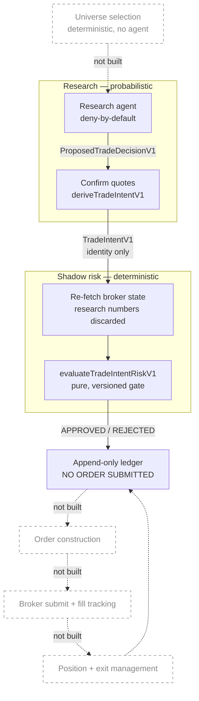
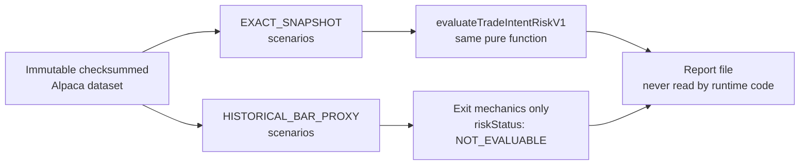

## The central invariant

An LLM decides *what to propose*. It never decides *whether the trade passes*.

That separation is enforced structurally, not by asking the model nicely:

- **`evaluateTradeIntentRiskV1`** ([`src/risk/risk-evaluation-v1.ts`](https://github.com/whanyu1212/greeks-in-the-loop/blob/develop/src/risk/risk-evaluation-v1.ts)) is a pure function — no I/O, no history, no ambient state. Same inputs, same verdict, forever. It is versioned via `RISK_RULE_VERSION`.
- **Research's numbers are never trusted for the gate.** Only the spread's *identity* crosses the boundary. Equity, buying power, positions, live quotes, greeks, volume/open interest, and the market clock are all re-fetched by the risk layer from the broker.
- **Failures return bounded reason codes**, never raw model input — so a model cannot smuggle prose into an audit record.
- **All money is integer cents.** Exit marks are half-cents per share so 50% thresholds stay exact.

## Research to risk flow

**Backtest replay** is a separate offline entry point (`pnpm backtest`), not a stage in this cycle:

Solid edges are implemented today. Dotted nodes are deferred: universe selection upstream, and the execution path downstream where the shadow decision is recorded but never acted on.

## Where to start

| If you want to understand… | Read |
| --- | --- |
| What the agent is allowed to trade, and why it is frozen | [Strategy V1](/strategy-v1) |
| The gate rules, thresholds, and rejection codes | [Risk Engine V1](/risk-engine-v1) |
| How untrusted model output becomes a typed intent | [Research Decision V1](/research-decision-v1) |
| Spread economics and the integer-cent unit discipline | [Trade Intent V1](/trade-intent-v1) |
| How decisions are audited and made tamper-evident | [Event Ledger V1](/event-ledger-v1) |
| How rules are tested offline against real market data | [Backtest Replay V1](/backtest-replay-v1) |

## Why "shadow mode" is the point

The pipeline ends by recording a decision to an append-only event ledger. Nothing is submitted to a broker.

This is not an unfinished execution path — it is the deliverable. The interesting engineering problem in an LLM trading system is not order submission; it is building a boundary where a probabilistic component can propose without being able to act, and proving that boundary holds. The ledger records what *would* have happened, with the rule version that decided it, so a rule change can be attributed rather than guessed at.

Backtest replay feeds `EXACT_SNAPSHOT` scenarios into the **same** `evaluateTradeIntentRiskV1` the live path uses, with no agent in the loop. Its report file is never read back by runtime code — no backtest result can influence a live decision, by design.
