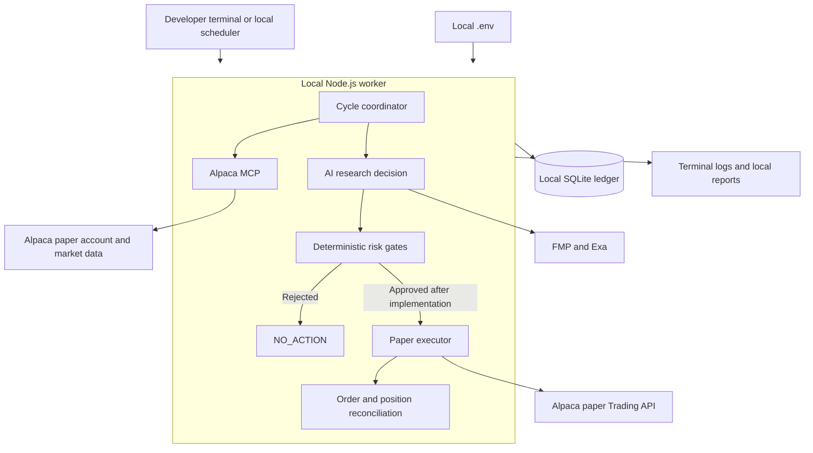

# Greeks in the Loop — Minimal Local Architecture Plan

## Table of contents

1. [Purpose](#1-purpose)
2. [Minimal local architecture](#2-minimal-local-architecture)
3. [Prerequisites](#3-prerequisites)
4. [Minimum setup](#4-minimum-setup)
5. [How to run](#5-how-to-run)
6. [Optional local scheduling](#6-optional-local-scheduling)
7. [Local state and recovery](#7-local-state-and-recovery)
8. [Files shared between local and GCP](#8-files-shared-between-local-and-gcp)
9. [Files that remain infrastructure-specific](#9-files-that-remain-infrastructure-specific)
10. [Configuration contract](#10-configuration-contract)
11. [Promotion path from local to GCP](#11-promotion-path-from-local-to-gcp)
12. [Current execution limitation](#12-current-execution-limitation)

Related plan: [GCP Architecture Plan](./architecture-plan.md)

## 1. Purpose

This plan describes the smallest practical way to run Greeks in the Loop autonomously on one developer machine using the repository's existing Node.js, OpenCode, Alpaca MCP, SQLite, and scheduling behavior.

The local environment is intended for:

- Development and debugging.
- Autonomous research and shadow-risk testing.
- Alpaca paper-account integration.
- Backtests and behavior evaluations.
- Validating deterministic paper execution after that capability is implemented.

It is not intended for high availability. The agent stops when the computer sleeps, loses power, disconnects from the network, or the process exits.

## 2. Minimal local architecture



The minimal setup has only one application process and one SQLite ledger. Do not start two standard workers against the same ledger or Alpaca paper account.

## 3. Prerequisites

Install and verify:

- Node.js 22.x.
- pnpm 10.33.0.
- Python 3.10+.
- `uv`/`uvx`.
- `zsh` on macOS or Linux.
- Git.
- A configured, non-interactive model provider supported by OpenCode.
- Alpaca paper, FMP, and Exa credentials.

From the repository directory:

```bash
node --version
pnpm --version
python3 --version
uvx --version
pnpm exec opencode --version
```

Node must remain on major version 22 because `package.json` specifies `>=22 <23`.

## 4. Minimum setup

Run from:

```bash
cd /Users/melloo21/Documents/alpaca-hackathon/greeks-in-the-loop
```

Install dependencies:

```bash
pnpm install --frozen-lockfile
```

Create the local secret file:

```bash
cp .env.example .env
```

Set at least:

```dotenv
ALPACA_API_KEY=your_paper_key
ALPACA_SECRET_KEY=your_paper_secret
FMP_API_KEY=your_fmp_key
EXA_API_KEY=your_exa_key
```

Configure the selected OpenCode model provider non-interactively. Do not commit `.env` or provider credentials.

Validate the code:

```bash
pnpm typecheck
pnpm test
pnpm build
```

## 5. How to run

### Interactive terminal research

Launch OpenCode from the repository root so it discovers `opencode.json`:

```bash
pnpm exec opencode
```

This is useful for manually prompting the configured Alpaca MCP, FMP, and Exa tools. It is not the autonomous scheduled worker.

### One normal autonomous cycle

```bash
pnpm agent:once
```

The normal worker applies market-session and research-window eligibility. Outside an eligible window, it should fail closed rather than force a decision.

### One research-only cycle at any time

```bash
pnpm agent:research-anytime
```

Use this for local research testing outside normal market windows. It uses a separate dry-run ledger and does not create a trade-eligible intent.

### One shadow-risk cycle at any time

```bash
pnpm agent:shadow-anytime
```

Use this to exercise research plus shadow trade-intent/risk behavior without paper execution. It uses a separate shadow ledger.

### Continuous worker

```bash
pnpm agent
```

The default interval is five minutes. The worker runs cycles sequentially, applies bounded failure backoff, and latches its breaker after repeated failures. Stop it with `Ctrl+C`.

For the simplest predictable local demonstration, prefer repeated one-shot commands over leaving a development terminal running indefinitely.

## 6. Optional local scheduling

### Recommended local competition schedule

Use the same schedule as GCP so local and cloud behavior are comparable:

| Time ET | Runs/day | Command intent |
|---|---:|---|
| 08:30 | 1 | Premarket research; no new order |
| Every 15 minutes, 09:45–15:45 | 25 | Reconcile, decide, manage, and potentially execute after execution exists |
| 16:15 | 1 | End-of-day reconciliation and report |

Total: **27 invocations per normal market day** and **135 per five-day market week**.

The application—not the local scheduler—must use Alpaca's market calendar to reject holidays, invalid sessions, and early-close conflicts.

### macOS scheduling

Use `launchd` for unattended local runs. Create infrastructure-specific property-list files outside application source that:

- Set the working directory to the repository root.
- Invoke the one-shot worker.
- Write logs to a bounded local location.
- Use the expected New York schedule.
- Prevent overlapping executions.
- Avoid embedding credentials in the property list.

`launchd` calendar definitions use the machine's timezone. Either configure the machine appropriately or use a small wrapper that checks the current `America/New_York` time before running. The worker's Alpaca calendar gate remains authoritative.

### Linux scheduling

Use `systemd` service and timer units equivalent to those described in the GCP plan. Validate timer expressions with:

```bash
systemd-analyze calendar 'your-expression'
```

### Simplest no-scheduler option

For a hackathon demonstration, manually start the continuous worker shortly before the first intended cycle:

```bash
pnpm agent
```

This is autonomous after startup, but it is less reproducible than an operating-system scheduler and stops when the terminal or computer stops.

## 7. Local state and recovery

The standard ledger defaults to:

```text
.state/research-ledger.sqlite
```

Anytime modes use separate ledgers so local experiments cannot modify standard worker state. Keep these ledgers separate.

Local operational rules:

1. Run one standard worker per ledger and paper account.
2. Do not synchronize a live SQLite database through Dropbox, iCloud Drive, or a network filesystem.
3. Stop the worker cleanly before moving state.
4. Use SQLite's backup API or a consistent backup command instead of blindly copying an active database.
5. Preserve the ledger when restarting; it contains lifecycle and breaker state.
6. Reconcile against Alpaca before acting after every restart.
7. Use `pnpm agent:reset-breaker` only after investigating and correcting the cause.

## 8. Files shared between local and GCP

The main design rule is: **share application behavior, schemas, tests, model policy, and dependency versions; inject infrastructure at the boundary.** The same Git commit and container image should behave consistently in local and GCP paper environments.

### Shared unchanged

| Repository path | Local use | GCP use | Sharing rule |
|---|---|---|---|
| `src/**/*.ts` | Runs application logic directly through `tsx` or compiled output | Compiled into the deployed image | Share unchanged; do not fork trading logic by environment |
| `tests/**/*` | Local validation | CI validation before GCP deployment | Share unchanged |
| `package.json` | Defines commands and exact runtime expectations | Drives image build and production command | Share unchanged |
| `pnpm-lock.yaml` | Reproducible local install | Reproducible CI/container install | Share unchanged and use `--frozen-lockfile` |
| `tsconfig.json` | Local type checking | CI type checking | Share unchanged |
| `tsconfig.build.json` | Local production build | Container production build | Share unchanged |
| `opencode.json` | Configures Alpaca MCP, FMP, Exa, and permissions | Included in the image and loaded by OpenCode | Share when commands are portable; keep exact mutation policy identical |
| `.opencode/**/*` | Checked-in agent and skill policy | Included in the deployed image | Share unchanged after security review |
| `scripts/**/*` | Local helper commands | Image/CI helper commands where portable | Share unchanged when they do not contain machine-specific paths |
| Strategy manifests and schemas under `src/strategy/` and `src/contracts/` | Defines local decisions | Defines cloud decisions | Must be identical so tested behavior is the deployed behavior |
| Risk logic under `src/risk/` | Local shadow/execution gates | GCP shadow/execution gates | Must be identical; environment must not weaken gates |
| Scheduling eligibility under `src/scheduling/` | Final local market-time authority | Final GCP market-time authority | Share unchanged; OS timers only wake the worker |
| Event-ledger code under `src/event-ledger/` | Reads/writes local SQLite | Reads/writes persistent-disk SQLite on the VM | Share unchanged for the simple VM architecture |
| `README.md` and architecture plans | Developer guidance | Deployment/operator guidance | Share in Git |

### Shared template, different values

| Item | Shared part | Local value source | GCP value source |
|---|---|---|---|
| Environment variables | Variable names, validation, defaults, and `.env.example` | Untracked `.env` | Secret Manager and VM runtime environment |
| Model configuration | Provider/model contract and supported model name | Local provider login or environment | Non-interactive provider credential from Secret Manager |
| Ledger path | `RESEARCH_LEDGER_PATH` contract | Repository `.state/` or a local absolute path | `/var/lib/greeks/.state/research-ledger.sqlite` |
| Log format | `AGENT_LOG_FORMAT` contract | Human-readable terminal output or JSON | JSON for Cloud Logging |
| Cycle timing | Eligibility rules and 27-run schedule | `launchd`, `systemd`, or continuous command | VM `systemd` timers |
| Execution switch | Same `EXECUTION_ENABLED` contract | `false` except controlled paper tests | `false` by default; enabled only after deployment approval |
| Alpaca endpoint | Paper-only endpoint contract | Local environment/default | GCP environment/default with startup assertion |

### Runtime artifacts that may be transferred carefully

| Artifact | Can be shared? | Safe method |
|---|---|---|
| Research reports and JSON artifacts | Yes | Upload/download through a private GCS bucket |
| Backtest datasets | Yes | Version and checksum them; store large datasets in GCS |
| Evaluation outputs | Yes | Store as CI or GCS artifacts |
| SQLite ledger snapshot | Only as an offline migration or backup | Stop writes and create a consistent SQLite backup; never have local and GCP write the same file |
| P&L and demo exports | Yes | Generate from broker/ledger state and upload to GCS |
| Logs | For analysis, not as runtime input | Redact credentials and sensitive headers before sharing |

## 9. Files that remain infrastructure-specific

Do not force local and GCP deployment mechanics into one file when their supervisors and secret systems differ.

| File or data | Local | GCP | Commit to Git? |
|---|---|---|---:|
| Secret values | `.env` | Secret Manager versions | No |
| OpenCode provider credential store | User configuration/environment | Runtime secret or service identity | No |
| SQLite runtime database | Local `.state/` | Persistent disk under `/var/lib/greeks` | No |
| Worker lock sidecar | Next to local ledger | Next to GCP ledger | No |
| Local scheduler definitions | `launchd` plist or developer `systemd` units | VM production `systemd` units | Templates may be committed; installed/generated files should not |
| Docker runtime overrides | Optional local Compose/CLI arguments | VM service unit and deployment metadata | Commit sanitized templates only |
| GCP IAM and resource IDs | Not applicable | Project, service accounts, bucket, registry, VM | Commit parameterized IaC; never credentials |
| Deployment workflow | Optional local helper | `.github/workflows` deployment workflow | Yes, without secrets |
| VM bootstrap | Not applicable | Startup/bootstrap script | Yes, if idempotent and secret-free |
| Backup destination | Local backup directory | Private GCS bucket | Configuration may be committed; data should not |

Recommended future repository layout:

```text
deploy/
  local/
    README.md
    com.greeks.agent.plist.example
  gcp/
    README.md
    greeks-agent.service
    greeks-agent.timer
    bootstrap.sh
  Dockerfile
```

Templates should use placeholders and environment variables rather than personal paths, project IDs, account numbers, or credentials.

## 10. Configuration contract

Keep one environment-variable contract across both infrastructures:

```dotenv
ALPACA_API_KEY=
ALPACA_SECRET_KEY=
FMP_API_KEY=
EXA_API_KEY=

ALPACA_TRADING_BASE_URL=https://paper-api.alpaca.markets
ALPACA_MARKET_DATA_BASE_URL=https://data.alpaca.markets
RESEARCH_LEDGER_PATH=.state/research-ledger.sqlite
AGENT_INTERVAL_MS=300000
AGENT_MAX_BACKOFF_MS=1800000
AGENT_MAX_CONSECUTIVE_FAILURES=5
AGENT_CYCLE_TIMEOUT_MS=300000
AGENT_CYCLE_ABORT_TIMEOUT_MS=5000
AGENT_LOG_FORMAT=pretty
EXECUTION_ENABLED=false
```

The exact model-provider variable depends on the selected provider. Pin an explicit supported model instead of relying on a previously selected interactive model.

Not every listed variable is necessarily implemented today. In particular, `EXECUTION_ENABLED` should be introduced with the deterministic executor and should default to `false` when absent.

Environment differences should affect deployment concerns—paths, logs, and secret delivery—not strategy behavior or risk thresholds. Risk-profile changes should be explicit, versioned configuration recorded with every intent.

## 11. Promotion path from local to GCP

1. Implement and test a change locally.
2. Run `pnpm typecheck`, `pnpm test`, and `pnpm build`.
3. Run research-anytime and shadow-anytime against isolated ledgers.
4. Open a pull request and let CI repeat validation.
5. Build one immutable container image from the approved commit.
6. Deploy that image to the GCP VM with execution disabled.
7. Run a cloud shadow cycle and compare its contracts and reports with local output.
8. Confirm the persistent ledger, logging, credentials, MCP tools, and paper endpoint.
9. Enable paper execution only through an explicit deployment approval after executor safety tests pass.
10. Never copy a local execution-enabled `.env` into GCP.

The deployable unit is the Git commit/container image. Runtime SQLite state is environment-owned and must not be promoted as if it were application code.

## 12. Current execution limitation

The repository currently presents itself as a non-executing research worker and disables Alpaca mutation tools in `src/index.ts`. Running locally—interactively, once, continuously, or on a timer—does not by itself create an autonomous trading application that places orders.

Before claiming competition-complete autonomous paper trading, implement and test:

- A deterministic Alpaca paper Trading API executor.
- Exact options-contract resolution in application code.
- Idempotent order submission with `client_order_id`.
- Fill, partial-fill, rejection, cancellation, and restart reconciliation.
- Deterministic profit, loss, invalidation, and time exits.
- An execution kill switch and daily breaker.

The AI should continue using Alpaca MCP for autonomous evidence gathering and decision support, while deterministic application code owns order construction, risk authority, and Trading API mutations.
